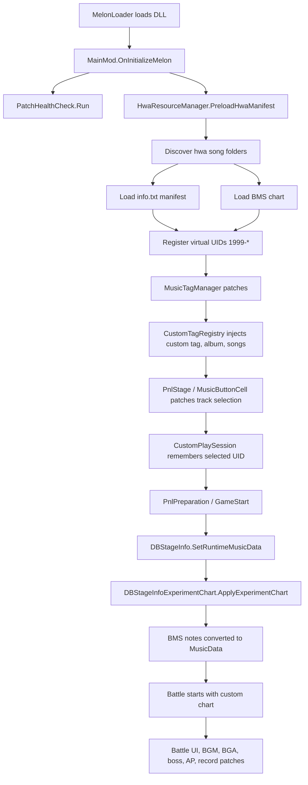

# 유지보수 지도

이 문서는 `muse-dash-custom-chart`를 처음 보는 사람이나 AI가 어디부터 읽어야 하는지 빠르게 파악하기 위한 지도입니다.
자세한 파일별 설명은 `docs/CODE_REFERENCE.md`, 사용법은 `docs/CUSTOM_CHART_GUIDE.md`, 로그 해석은 `docs/LOGGING_AND_TROUBLESHOOTING.md`를 봅니다.

---

## 한 줄 요약

이 모드는 `hwa/` 폴더의 커스텀 곡 리소스를 읽고, 게임 DB에 가상 곡/앨범을 주입한 뒤, 곡 선택 상태에 따라 `DBStageInfo.SetRuntimeMusicData` 시점에 원본 차트 데이터를 커스텀 BMS 기반 노트로 재구성합니다.

---

## 먼저 볼 파일 10개

| 우선순위 | 파일 | 역할 |
| --- | --- | --- |
| 1 | `muse dash test/MainMod.cs` | MelonLoader 진입점, 초기화, 프레임 업데이트, 씬 전환 처리 |
| 2 | `muse dash test/Core/FeatureGuard.cs` | 기능별 예외 격리, 로그 스로틀링, 자동 비활성화 |
| 3 | `muse dash test/Core/GameBindings.cs` | 게임 업데이트에 취약한 raw 문자열 식별자 모음 |
| 4 | `muse dash test/Patches/Diagnostics/PatchHealthCheck.cs` | 시작 시 Harmony 패치 대상 생존 여부 점검 |
| 5 | `muse dash test/Patches/Hwa/HwaResourceManager.cs` | `hwa/` 곡 폴더 탐색, manifest/BMS 캐시, 커스텀 UID 판정 |
| 6 | `muse dash test/Patches/Hwa/HwaManifestLoader.cs` | `info.txt` 파싱 |
| 7 | `muse dash test/Patches/UI/Custom/Tags/CustomTagRegistry.cs` | 커스텀 태그/가상 앨범/가상 곡 주입 진입점 |
| 8 | `muse dash test/Core/CustomPlaySession.cs` | 현재 선택 곡, 실험 모드 여부, 커스텀 차트 적용 여부 저장 |
| 9 | `muse dash test/Patches/Database/Stage/DBStageInfoPatch.cs` | 게임의 런타임 차트 생성 시점을 잡는 핵심 Harmony 패치 |
| 10 | `muse dash test/Patches/Database/Stage/DBStageInfoExperimentChart.cs` | 실제 노트 복제, 이동, 타입 적용, BMS 주입 실행 |

---

## 핵심 흐름



---

## 시스템별 책임

### 초기화와 안전장치

`MainMod`는 모드의 생명주기 중심입니다. 시작 시 폴더 생성, manifest 선로드, 패치 상태 점검, 설정 로드 등을 수행합니다.

`FeatureGuard`는 매 프레임 또는 씬 전환에서 호출되는 기능을 감싸서 한 기능의 예외가 전체 모드를 죽이지 않게 합니다. 새 기능을 `OnUpdate`, `OnGUI`, 씬 이벤트에 넣을 때는 가능하면 `FeatureGuard.Run("기능명", ...)`으로 감쌉니다.

`PatchHealthCheck`는 게임 업데이트 후 Harmony 대상 메서드가 사라졌는지 확인합니다. 패치가 갑자기 동작하지 않으면 먼저 이 로그를 봅니다.

`GameBindings`는 컴파일러가 검증하지 못하는 문자열 메서드명을 모으는 곳입니다. 새 raw 문자열 패치 대상이 생기면 가능한 한 여기에 추가합니다.

### 커스텀 곡 로딩

`HwaResourceManager`가 `hwa/` 하위 폴더를 정렬 순서대로 읽고 `1999-1`, `1999-2` 같은 가상 곡 UID를 부여합니다.

`HwaManifestLoader`는 `info.txt`를 읽어 제목, 아티스트, 난이도, 원본 숙주 UID, 씬 번호, delay/offset 같은 메타데이터를 만듭니다.

`HwaResourceManager.Bms.cs`는 곡 폴더에서 `.bms` 파일을 찾고 `BmsParser` 결과를 캐시에 저장합니다. 파일 변경 감시는 `HwaResourceManager.Watcher.cs`가 담당합니다.

### 가상 곡/앨범 주입

`CustomTagRegistry`와 `CustomTagRegistrySupport`는 게임의 음악/앨범 DB에 커스텀 태그, 가상 앨범, 가상 곡을 넣습니다.

이 부분은 순정 DB 객체를 얇게 복제해서 사용하므로, 원본 곡/앨범의 구매 정보나 세이브 데이터를 오염시키지 않는 것이 중요합니다. 관련 보호 로직은 `SaveDataManagerPatch`, `CustomRecordStore`, `CustomContentIds`와 함께 봅니다.

### 곡 선택 상태 추적

`PnlStagePatch`, `MusicButtonCellPatch`, `MusicButtonAreaTitlePatch`, `PnlPreparationPatch`는 사용자가 어떤 곡을 보고 있는지, 실험 모드 태그 안에 있는지, 실제 플레이에 커스텀 차트를 적용해야 하는지 추적합니다.

최종 판정은 `CustomPlaySession.Current.ShouldApplyExperimentChart`에 모입니다. 커스텀 차트가 원치 않는 순정 곡에 적용되면 이 값을 먼저 의심합니다.

### 차트 주입

`DBStageInfoPatch`는 게임이 런타임 노트 리스트를 만드는 `DBStageInfo.SetRuntimeMusicData`를 후킹합니다.

`DBStageInfoExperimentChart`는 원본 노트를 복제하고, BMS 또는 `ExperimentNotes` 스펙을 `MusicData`로 변환해 리스트에 다시 넣습니다.

부속 partial 파일의 대략적 역할은 다음과 같습니다.

| 파일 | 역할 |
| --- | --- |
| `DBStageInfoExperimentChart.Bms.cs` | BMS 노트를 내부 `ExperimentNoteSpec`으로 변환 |
| `DBStageInfoExperimentChart.Resolve.cs` | UID, 프리팹, 효과음, 노트 타입 해석 |
| `DBStageInfoExperimentChart.Sorting.cs` | 노트 정렬 및 double 상태 보정 |
| `DBStageInfoExperimentChart.Schema.cs` | 스펙/상수/헬퍼 모델 |
| `DBStageInfoExperimentChart.Diagnostics.cs` | 노트 덤프와 디버그 로그 |

### 배틀 중 부가 기능

배틀 진입 후에는 아래 기능들이 추가로 작동합니다.

| 영역 | 주요 파일 | 역할 |
| --- | --- | --- |
| 오디오/BGA | `HwaBattleMediaController*`, `HwaSyncManager` | 커스텀 BGM/BGA 재생, 정지, 싱크 |
| 메뉴 BGM | `HwaMenuBgmController` | 곡 선택/준비 화면에서 `music.ogg` 핫스왑 |
| 보스 | `BossPatch`, `BmsBossSwapPlanner` | BMS 이벤트 기반 보스 교체/액션 |
| 정확도/결과 | `APModPatch`, `CustomRecordStore` | 커스텀 차트 정확도, AP 배너, 기록 저장 |
| UI 보조 | `InputOverlay`, `JudgmentBar`, `ProgressBarPatch` | 입력 표시, 판정바, 진행바 제어 |
| 씬/렌더 보정 | `SceneZzTransformTracker*`, `SceneFlowPatch` | 씬 전환, 노트/배경 관련 런타임 보정 |

---

## 업데이트 후 먼저 점검할 곳

게임 업데이트 뒤 문제가 생기면 아래 순서로 봅니다.

1. `Latest.log`에서 `[PatchHealth]` 경고 확인
2. 깨진 메서드명이 있으면 `GameBindings.cs` 또는 해당 `[HarmonyPatch]` 문자열 확인
3. 커스텀 곡이 안 보이면 `CustomTagRegistry`와 `MusicTagManager.InitAlbumTagInfo` 패치 확인
4. 곡은 보이는데 차트가 순정이면 `CustomPlaySession.ShouldApplyExperimentChart` 확인
5. 차트 주입 로그가 없으면 `DBStageInfo.SetRuntimeMusicData` 패치 확인
6. BMS는 읽히는데 노트가 이상하면 `BmsParser`, `BmsNoteMatcher`, `DBStageInfoExperimentChart.Bms.cs` 확인
7. 배틀 미디어만 이상하면 `HwaBattleMediaController`, `HwaSyncManager`, `HwaMenuBgmController` 확인

---

## AI에게 작업을 맡길 때 붙여넣을 요약

```text
이 프로젝트는 Muse Dash용 MelonLoader 커스텀 차트 모드다.
핵심 흐름은 MainMod 초기화 -> HwaResourceManager가 hwa 폴더와 info.txt/BMS를 읽음 -> CustomTagRegistry가 1999-* 가상 곡/앨범을 게임 DB에 주입 -> UI 패치가 선택 상태를 CustomPlaySession에 저장 -> DBStageInfo.SetRuntimeMusicData 패치가 BMS 기반 MusicData를 주입 -> 배틀 중 BGM/BGA/보스/정확도/기록 패치가 보조한다.

순정 세이브와 원본 DB 객체를 오염시키면 안 된다.
FeatureGuard, PatchHealthCheck, GameBindings 구조는 유지한다.
새 Harmony 대상 문자열이나 게임 내부 raw 문자열은 가능한 GameBindings로 모은다.
커스텀 차트 적용 여부는 CustomPlaySession.Current.ShouldApplyExperimentChart를 우선 확인한다.
커스텀 곡 UID 규칙은 CustomContentIds를 따른다.
빌드 검증은 dotnet build "muse dash test\muse dash test.csproj" --configuration Debug 로 한다.
```

---

## 수정할 때 지켜야 할 규칙

- 순정 곡/앨범/세이브를 직접 바꾸는 코드는 피하고, 가상 UID 또는 복제 객체에만 적용합니다.
- 매 프레임 실행되는 코드는 `FeatureGuard`와 캐시를 사용해 예외/리플렉션/탐색 비용을 줄입니다.
- 게임 업데이트에 취약한 문자열은 흩뿌리지 말고 `GameBindings`나 가까운 상수로 모읍니다.
- 진단 코드는 가능하면 `Diagnostics` 파일 또는 명확한 디버그 플래그 뒤에 둡니다.
- 새 기능은 “패치 진입점”, “상태 판정”, “Unity 적용”, “로그/진단” 책임을 가능한 분리합니다.
- 빌드가 통과해도 게임 런타임 동작은 별개이므로, 핵심 흐름 로그까지 확인합니다.

---

## 문서 길잡이

| 필요 | 문서 |
| --- | --- |
| 전체 지도 | `docs/ARCHITECTURE.md` |
| 파일별 상세 설명 | `docs/CODE_REFERENCE.md` |
| 커스텀 곡 제작법 | `docs/CUSTOM_CHART_GUIDE.md` |
| BMS 규칙 | `docs/BMS_PARSING.md` |
| 로그/문제 해결 | `docs/LOGGING_AND_TROUBLESHOOTING.md` |
| UID/태그 주입 | `docs/UID_INJECTION.md`, `docs/CAST_AND_CUSTOM_TAG_GUIDE.md` |
| 보스/씬 연출 | `docs/BOSS_EXPERIMENTS.md`, `docs/SCENE_BACKGROUND_SWAP.md` |

