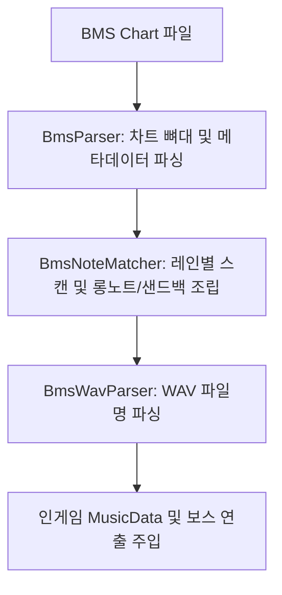

# BMS 파싱 및 매핑 가이드 (BMS Parsing & Mapping Guide)

이 문서는 모드 내부의 BMS 파싱 엔진(`BmsParser`, `BmsWavParser`, `BmsNoteMatcher`)이 Be-Music Source 차트 파일을 분석하여 뮤즈 대쉬의 실제 인게임 `MusicData` 노트로 변환하는 핵심 매핑 규칙과 시스템 사양을 설명합니다.

---

## 1. 개요 및 파싱 흐름

BMS 파일의 헤더에 선언된 `#WAVxx [파일명]` 리스트는 차트 노드의 원시 문자열 값(`RawValue`)과 결합하여 해당 노드의 성격(일반 노트, 롱노트, 하트, 음표, 보스 액션 등)과 리소스 종류(프리팹, 사운드, 오프셋 등)를 결정합니다.

---

## 2. WAV 파일명 기본 파싱 규칙 (`BmsWavParser`)

WAV 파일명은 디자이너의 가독성을 높이기 위한 한국어 설명과 기계용 UID, 오프셋 메타데이터가 융합된 형태를 지니며, 다음과 같은 단계로 정교하게 파싱됩니다.

### ① UID 추출 (6자리 숫자)
* 파일명의 가장 첫 부분에 등장하는 6자리 숫자(`zzxxyy` 구조)를 정규표현식(`^([0-9]{6})`)으로 추출합니다.
* 예: `011001_일반 노트1 지상 노멀_dt1.48.wav` ➡️ UID: `011001`

### ② 인간용 주석 필터링 (`ContainsHumanLabel`)
* 파일명 중간에 들어간 디자이너용 한국어 설명, 화이트스페이스, 괄호 등 아스키 범위를 넘어선 한글 레이블을 자동으로 제거하고 정규 프리팹명을 완성합니다.
* 설명 문자열이 제거되면 최종 프리팹명은 시스템이 이해할 수 있도록 **순수 6자리 UID**로 자동 대체됩니다.
* 예: `000201_하트 지상_dt1.48.wav` ➡️ 한글 및 공백 제거 ➡️ 프리팹명: `000201`

### ③ 선행 표시 시간 (`dt`) 추출
* 파일명 끝부분의 `_dt[소수]` 패턴을 찾아 선행 노출 시간 오프셋 값을 소수점 셋째 자리까지 반올림하여 추출합니다.
* 예: `011001_..._dt1.48.wav` ➡️ `Dt` = `1.48`초
* 만약 파일명에 `_dt` 정보가 존재하지 않는다면 기본 폴백 값(`-1.0`)을 유지하며, 게임은 기본 시스템 dt(`1.47`초)를 사용합니다.

---

## 3. UID 구성 요소별 노트 타입 매핑

추출된 6자리 UID(`zzxxyy` 구조) 중 중간 2자리(`xx`) 또는 접두사를 분석해 게임 내의 실질적인 노트 타입(`NoteType`)을 정합니다.

| 분류 | UID 패턴 (`zzxxyy`) | NoteType | 설명 및 추가 속성 |
| :--- | :--- | :--- | :--- |
| **롱노트** | `xx == "02"` | **`3`** | `BmsNoteMatcher`에 의해 시작과 끝 쌍이 동적으로 매칭되어 롱노트 체인 생성 |
| **톱니바퀴** | `xx == "03"` | **`2`** | 톱니 장애물 |
| **샌드백** | `xx == "04"` (단, `0004…` 제외) | **`8`** | 다중 타격이 필요한 단일 슬롯 멀티히트 노트 |
| **발사체** | `xx == "06" \|\| xx == "07" \|\| xx == "08"` | **`1`** | 보스 투사체 형태의 일반 노트 (기본 `dt=0.7`초) |
| **고스트** | `xx == "17"` | **`4`** | 유령 노트 |
| **하트** | `0002` 접두사로 시작 | **`6`** | 체력 회복 노트, 효과음 `sfx_hp` 자동 보정 |
| **음표** | `0003` 접두사로 시작 | **`7`** | 점수 노트, 효과음 `sfx_score` 자동 보정 |
| **씬 전환** | `0004` 접두사로 시작 | **`9`** | 씬 전환 토글. `xx=04`라 샌드백과 겹치므로 `0004` 접두사가 우선 분류. 끝 2자리(`yy`)=전환할 씬 번호이며 `ibms_id`가 자동 매핑됨 (쌍 매칭 안 함, 단일 주입). 씬 전환 차트의 프리로드 단계에서는 BMS 원본 `zzxxyy`의 `zz`를 보존해 해당 `zz` 리소스로 굽는 것이 중요함 |
| **복선** | `xx == "05"` | **`1`** | 동시치기(Dual) 노트를 위한 UID |
| **빅노트** | `xx == "13" \|\| xx == "14"` | **`1`** | 대형 일반 노트 |
| **해머** | `xx == "15"` | **`1`** | 해머 판정 (일반 노트 타입 1로 처리) |
| **라이더** | `xx == "16"` | **`1`** | 라이더 판정 (일반 노트 타입 1로 처리) |

---

## 4. 보스 발사체 & 보스 톱니의 보스 동반 여부 판별

보스 발사체(`xx=06/07/08`) 및 보스 톱니(`xx=09`)는 **보스가 화면상에 존재하며 특정 공격 모션으로 발사할지(보스 있는 버전)**, 아니면 **보스 없이 독자적으로 장애물처럼 날아갈지(보스 없는 버전)**를 결정할 수 있습니다.

> [!NOTE]
> 한국어 가이드 설명 속에 `"보스"`라는 단어가 상시 들어갈 수 있으므로, 보스 동반 여부는 파일명 끝부분의 **영어 예약 키워드 `_boss` 또는 `_atk` 존재 유무**로 판정합니다.

### ❶ 보스 없는 버전 (Without Boss)
* **파일명 조건**: 영어 키워드 `_boss` 또는 `_atk`가 파일명에 없음
* **예시**: `#WAV0B 010601_보스 발사체1 지상 노멀_dt0.7.wav`
* **동작**: `BossAction = ""`으로 비워두어 보스 연출 없이 독자적으로 장애물이 날아갑니다.

### ❷ 보스 있는 버전 (With Boss)
* **파일명 조건**: 영어 키워드 `_boss` 또는 `_atk`가 파일명에 포함됨
* **예시**: `#WAV0C 010601_보스 발사체1 지상 노멀_boss_dt0.7.wav`
* **동작**: `BossAction`이 아래의 기준에 맞춰 자동으로 주입되고, 보스의 사전 전조 애니메이션 재생 시간을 확보하기 위해 **`Dt`가 `0.7`초로 강제 할당**됩니다.
* **보스 공격 액션 매핑 상세**:
  1. 파일명 내에 구체적인 액션명(`boss_far_atk_1_r` 등)이 명시적으로 포함되어 있다면 해당 액션을 최우선 적용합니다.
  2. 명시되지 않은 경우 UID 뒷자리 패턴에 기반해 스마트 매핑을 진행합니다:
     * `0601` / `0902` / `0903` ➡️ `boss_far_atk_1_R` (지상 원거리1)
     * `0604` / `0906` ➡️ `boss_far_atk_1_L` (공중 원거리1)
     * `0701` / `0704` / `0801` / `0804` / `0908` / `0909` / `0911` / `0912` ➡️ `boss_far_atk_2` (원거리2)

---

## 5. 실시간 동적 보스 로딩 (BMS 연동)

보스가 최초 생성되는 로딩 단계(`InitBossObject`)에서 **BMS 차트에 등록된 타임라인 정보를 실시간 분석**하여 해당 곡의 첫 번째 보스를 결정합니다.

* **동작 프로세스**:
  1. BMS 차트의 모든 노트 중 시간(Time) 및 틱(Tick) 순서대로 정렬하여 **가장 먼저 출현하는 `in` (보스 등장) 노트를 스캔**합니다.
  2. 해당 노트가 지닌 보스 이름(`BossName`)과 씬 번호(`BossScene`)를 획득합니다.
  3. 로드될 실제 보스를 획득한 보스 모델 및 씬으로 강제 치환합니다.
* **사용 및 장점**:
  * 빌드나 컴파일을 새로 하지 않아도, BMS 차트의 첫 보스 등장 노트를 `010101`로 지정하면 자동으로 `0101_boss(scene 1)` 보스가 호출됩니다.
* **폴백 안전판 (Fallback)**:
  * BMS 내에 등장(`in`) 연출 노트가 설계되지 않은 경우에는 `BossRewriteRules` 정적 규칙 배열을 참조해 디폴트 보스를 로드합니다.

---

## 6. 시간 및 틱 계산 공식 (BMS Time & Tick Calculation)

모드는 BMS 차트의 음표(Tick) 데이터를 인게임의 재생 시간(Time)으로 변환할 때, 변동 BPM을 고려한 **틱 기반 시간 누적 공식**을 사용합니다.

### ① 시간 환산 기본 공식 (BPM 기준)
특정 BPM 하에서의 1박자 기준 시간 환산 상수는 4분음표 길이와 맞물려 다음과 같은 공식으로 도출됩니다:
$$\Delta\text{Time} = \Delta\text{Tick} \times \frac{240}{\text{CurrentBpm}}$$

- **BmsParser 내부 구현**: `time += deltaTick * 4.0f * (60.0f / currentBpm)`
- 이 공식은 1 마디(Bar)를 1.0 Tick 단위(4박자)로 설정하는 BMS 틱 표준 규격에 따라 산출되었습니다.

### ② BPM 변경 (BPM Change) 대응 프로세스
- 차트 로딩 시점에 모든 `#BPMxx` 선언 및 직접 BPM 변경 이벤트들을 탐색하여 정렬된 `BpmChanges` 리스트를 구성합니다.
- 특정 틱의 시간을 구할 때, 리스트 상의 이전 BPM 변경 내역들을 순차적으로 적용하여 누적된 시간(`Time`)을 합산합니다:
  $$\text{AccumulatedTime} = \sum \left( (\text{ChangeTick}_{n} - \text{ChangeTick}_{n-1}) \times \frac{240}{\text{Bpm}_{n-1}} \right) + (\text{TargetTick} - \text{LastChangeTick}) \times \frac{240}{\text{LastBpm}}$$
