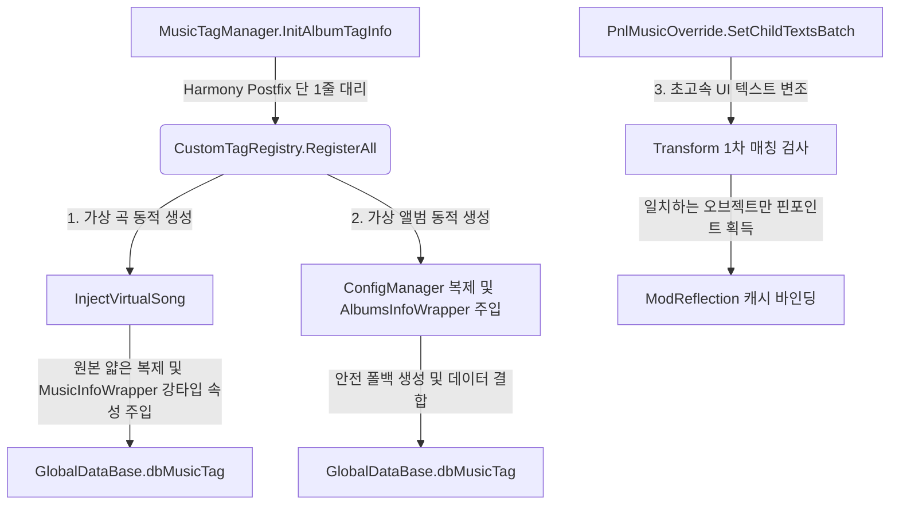

# 🎵 캐스트 추상화 및 커스텀 태그 동적 주입 가이드 (Cast & Custom Tag Guide)

이 문서는 뮤즈대시 모드의 **유니버설 래퍼 패턴(Universal Wrapper Pattern)**과, 이를 기반으로 한 **커스텀 태그(실험 모드) 및 가상 곡/앨범 동적 주입** 시스템의 구조를 설명합니다.

> 비유로 먼저 큰 그림을 잡고 싶다면 → [비유로 이해하는 모드 구조](ANALOGIES.md)

---

## 🏗️ 1. 한눈에 보는 데이터 흐름 (Master Architecture)

패치 레이어와 비즈니스 로직을 분리하여 게임 업데이트 시 코드 수정을 최소화합니다.



---

## 💎 2. 래퍼와 얇은 복제 (Wrapper & Clone)

> 이 절의 개념을 비유로 보려면 → [통역사](ANALOGIES.md#21-유니버설-래퍼--통역사-) · [잘 되는 것 복사](ANALOGIES.md#22-얇은-복제--잘-되는-것을-복사한-뒤-이름표만-교체-) · [가격표 떼기](ANALOGIES.md#23-구매-정보-정리--복사된-가격표-떼기-)

### 2.1 유니버설 래퍼 (Universal Wrapper)
IL2CPP 네이티브 메모리 객체를 직접 다루면 게임 업데이트 때마다 필드 구조가 바뀌어 매번 코드를 고쳐야 합니다. 래퍼 계층(`Il2CppWrapperBase`)을 두면 모더는 C# 강타입 프로퍼티로 접근하고, 래퍼가 리플렉션으로 네이티브 값을 읽고 씁니다.

* **[Il2CppWrapperBase.cs](file:///H:/source/repos/muse%20dash%20test/muse%20dash%20test/Patches/Common/Il2CppWrapperBase.cs)**: 모든 래퍼의 베이스 클래스로, 리플렉션 조회를 담당합니다.
* **[ModReflection.cs](file:///H:/source/repos/muse%20dash%20test/muse%20dash%20test/Patches/Common/ModReflection.cs)**: 래퍼가 사용하는 필드 검색 모듈입니다. 개발사(PeroPeroGames)가 변수명 앞에 `m_`을 붙이거나 컴파일 과정에서 백킹 필드(`_k__BackingField`)로 이름이 바뀌어도, 대소문자를 무시하고 찾아내어 조회 실패로 인한 오류를 방지합니다.
* **[MusicInfoWrapper.cs](file:///H:/source/repos/muse%20dash%20test/muse%20dash%20test/Patches/Common/MusicInfoWrapper.cs) & [AlbumsInfoWrapper.cs](file:///H:/source/repos/muse%20dash%20test/muse%20dash%20test/Patches/Common/AlbumsInfoWrapper.cs)**: 각각 곡 정보(`MusicInfo`)와 앨범 정보(`AlbumsInfo`) 전용 래퍼입니다.

---

### 2.2 얇은 복제 (Thin Clone)
커스텀 곡 객체를 `new`로 처음부터 만들면 내부 구조의 사소한 불일치로 크래시가 날 수 있습니다. 대신 이미 정상 동작하는 원본 곡 객체를 `MemberwiseClone()`으로 복사한 뒤, 식별자와 제목 등 메타데이터만 덮어쓰는 방식이 안전합니다.

* **`InjectVirtualSong`**: 원본 곡을 얕게 복사해 내부 구조를 보존한 뒤, `MusicInfoWrapper`로 식별자(`1999-0`)와 제목을 덮어씁니다.
* **폴백 가드 (Fallback)**: 복제가 실패하면 임시 객체(`new AlbumsInfo()`)를 세우는 폴백을 작동시켜 크래시를 방지합니다.

---

### 2.3 상품 식별자 정리 (CleanPurchase)
원본 곡을 복제하면 원본의 DLC 구매 관련 속성까지 함께 복사되어, 유저에게 구매 팝업이 뜰 수 있습니다. 복제 직후 이 속성들을 비워 가상 곡을 무료로 사용할 수 있게 만듭니다.

* **독립성 유지**: `CleanPurchaseProperties`는 복제본에 상속된 `dlc`, `needPurchase`, `pay_ids` 등의 속성만 정리하므로, 기존 정식 상점이나 원본 구매 기록에는 영향을 주지 않습니다.

---

## 🏷️ 3. 커스텀 태그 및 가상 곡/앨범 동적 주입 (Custom Tag & Registry)

[CustomTagRegistry.cs](file:///H:/source/repos/muse%20dash%20test/muse%20dash%20test/Patches/UI/Custom/Tags/CustomTagRegistry.cs) 클래스는 커스텀 카테고리(실험 모드)를 동적으로 이식하는 일련의 시퀀스를 지휘합니다.

1. **태그 탭 생성**:
   태그 버튼이 인스턴스화되는 시점에 모드가 개입하여 아래 사양의 가상 태그를 등록합니다.
   ```csharp
   var info = new AlbumTagInfo
   {
       name = "Experiment Mod",
       tagUid = "tag-muse-dash-test",
       iconName = "IconCustomAlbums" // 커스텀 앨범 전용 기본 아이콘
   };
   ```
2. **UI 아이콘 강제 변조 (`AlbumTagToggle_Init_Patch`)**:
   인게임 태그 탭 목록이 그려질 때, 모드는 탭 버튼이 가상 태그 UID(`tag-muse-dash-test`)를 참조하고 있는지 확인합니다. 일치하는 경우, DLL에 내장된 커스텀 이미지(`tag_icon.png`)를 런타임에 텍스처(`Texture2D`)로 디코딩하여 탭의 아이콘 이미지 필드에 덮어씁니다.

---

## 🚨 4. 패치 헬스체크와 자동 덤프

> 비유 설명 → [점검 센서](ANALOGIES.md#31-패치-헬스체크--켤-때마다-도는-점검-센서-)

게임 업데이트로 후킹 대상 메서드(`InitAlbumTagInfo`)의 시그니처나 위치가 바뀌면 패치가 실패해 모드가 멈출 수 있습니다. 이를 막기 위해 모드 로드 시점에 후킹 대상의 유효성을 자가 진단합니다.

* **감지 및 자동 덤프**: `InitAlbumTagInfo` 메서드를 찾지 못하면, `MusicTagManager` 클래스에서 `Init`으로 시작하는 모든 메서드 정보를 `hwa/tag_manager_dump.txt` 파일로 출력합니다.
* **복구 힌트**: 모더는 이 덤프 파일에서 바뀐 메서드 이름을 찾아 코드를 즉시 업데이트할 수 있습니다.

---

## 🛠️ 5. 확장 및 변형 개발자 가이드 (Developer Extension)

### 5.1 새로운 가상 곡을 추가하고 싶을 때
[CustomTagRegistry.cs](file:///H:/source/repos/muse%20dash%20test/muse%20dash%20test/Patches/UI/Custom/Tags/CustomTagRegistry.cs) 파일 내의 `RegisterAll` 메소드 중간 지점(가상 곡 주입부)에 다음과 같이 신규 가상 곡 호출을 한 줄 적어넣으시면 즉시 적용됩니다.

```csharp
// "1999-3" 가상 곡 신규 추가 예시
InjectVirtualSong(
    originalInfo, 
    "1999-3",             // 가상 곡 고유 UID
    "새로운 실험곡 3",       // 표시될 곡 제목
    "작곡가 이름",          // 아티스트 명
    "레벨 디자이너",         // 디자이너 명
    "iyaiya_cover",       // 커버 아트 프리팹
    "iyaiya_map",         // 노트 배치 JSON 리소스명
    "iyaiya_music",       // 오디오 클립 리소스명
    3, 6,                 // 난이도 (이지, 하드 등)
    musicList             // 등록 리스트 컨텍스트
);
```

이후 `build.bat`를 통해 빌드하면 게임의 "실험 모드" 태그 탭 아래에 새 곡이 동적으로 주입됩니다!
