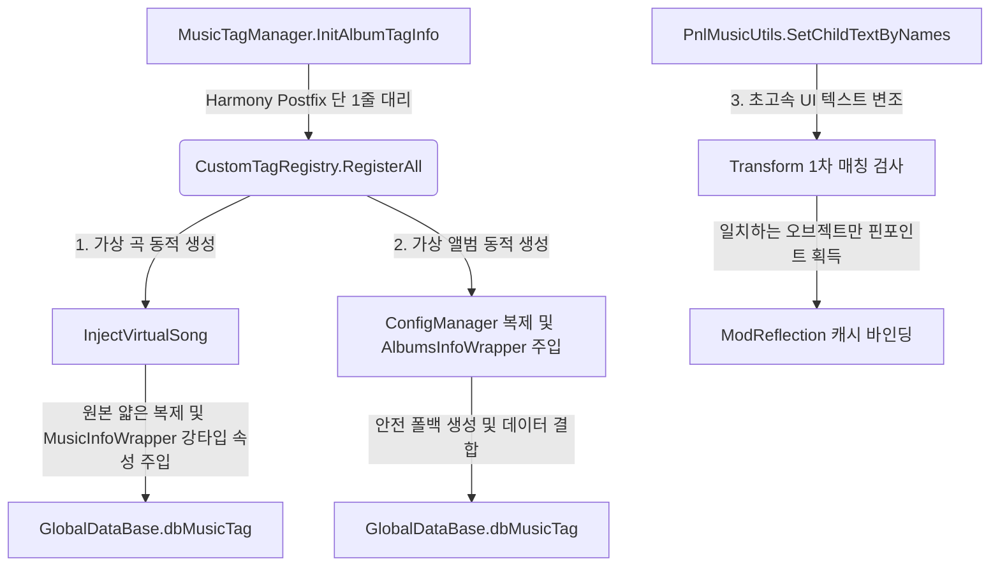

# 🎵 캐스트 추상화 및 커스텀 태그 동적 주입 가이드 (Cast & Custom Tag Guide)

이 문서는 뮤즈대시 모드 내에서 타입 결합도(Coupling)를 낮추기 위한 **유니버설 래퍼 패턴(Universal Wrapper Pattern)** 프레임워크와, 이를 기반으로 구현된 **커스텀 태그(실험 모드) 및 가상 곡/앨범 동적 주입** 시스템의 구조를 모더들의 눈높이에 맞춰 직관적인 비유로 설명합니다.

---

## 🏗️ 1. 한눈에 보는 데이터 흐름 (Master Architecture)

패치 레이어와 비즈니스 로직을 완벽히 격격분리하여 게임 업데이트 시 코드 수정을 최소화합니다.



---

## 💎 2. 만능 번역가와 얇은 복제 (Wrapper & Clone Analogies)

### 2.1 유니버설 래퍼 (Universal Wrapper) ➡️ "만능 번역가" 🗣️
> **비유**: 외국어로 작성된 난해한 매뉴얼(IL2CPP 네이티브 메모리 객체)을 모더가 직접 해독하려면 게임이 업데이트될 때마다 번역법이 바뀌어 뇌가 폭사하기 십상입니다.
> 그래서 중간에 유능한 **'만능 번역가(`Il2CppWrapperBase`)'**를 고용했습니다. 모더는 깔끔하게 한글/영어(C# 강타입 프로퍼티)로 번역가에게 요청하고, 번역가는 은밀히 네이티브 값을 가져다줍니다.

* **[Il2CppWrapperBase.cs](file:///H:/source/repos/muse%20dash%20test/muse%20dash%20test/Patches/UI/Common/Wrappers/Il2CppWrapperBase.cs)**: 모든 번역가의 조상 클래스로, 리플렉션 조회를 담당합니다.
* **[ModReflection.cs](file:///H:/source/repos/muse%20dash%20test/muse%20dash%20test/Patches/UI/Common/Reflection/ModReflection.cs)**: 번역가의 눈과 귀 역할을 하는 검색 엔진입니다. 개발사(PeroPeroGames)가 변수명 앞에 `m_`을 붙이거나 컴파일 과정에서 뒷배경 필드(`_k__BackingField`)로 이름을 비틀어도, 대소문자를 무시하고 유연하게 찾아내어 코드가 터지는 것을 원천 방지합니다.
* **[MusicInfoWrapper.cs](file:///H:/source/repos/muse%20dash%20test/muse%20dash%20test/Patches/UI/Common/Wrappers/MusicInfoWrapper.cs) & [AlbumsInfoWrapper.cs](file:///H:/source/repos/muse%20dash%20test/muse%20dash%20test/Patches/UI/Common/Wrappers/AlbumsInfoWrapper.cs)**: 각각 곡 정보(`MusicInfo`)와 앨범 정보(`AlbumsInfo`) 전용 번역가입니다.

---

### 2.2 얇은 복제 (Thin Clone) ➡️ "주방 통째 복사" 🍳
> **비유**: 새로운 요리(커스텀 곡)를 서비스하기 위해 건물 구조와 주방 도구, 인테리어(`new`로 생성한 빈 오브젝트)를 맨땅에 처음부터 세우다간 사소한 규격 오류로 건물이 통째로 붕괴(게임 크래시)할 수 있습니다.
> 가장 안전한 방법은 이미 완벽하게 작동 중인 이웃 맛집 주방(`Memory of Beach` 등 원본 곡 객체)을 통째로 카피(`MemberwiseClone()`)한 뒤, 칠판의 메뉴판 글씨(곡 제목, 난이도 등)만 슥슥 지우고 새 요리 이름으로 바꿔치기하는 것입니다.

* **`InjectVirtualSong`**: 원본 곡을 얇게 복사하여 기초 구조를 100% 보존한 뒤, `MusicInfoWrapper`(번역가)를 이용해 식별자(`1999-0`)와 실제 제목을 덮어씁니다.
* **폴백 가드 (Fallback)**: 만약 얇은 복제가 어떠한 이유로 실패한다면 맛이 살짝 덜하더라도 임시 가설 부스(`new AlbumsInfo()`)를 세우는 최소한의 구호 조치를 작동시켜 크래시를 방지합니다.

---

### 2.3 상품 식별자 정리 (CleanPurchase) ➡️ "탯줄 자르기" ✂️
> **비유**: 맛집 주방을 똑같이 복사하다 보니, 원본 맛집이 유료 프랜차이즈 회원권(DLC 구매 필요 상태)을 요구한다는 라이선스 스티커까지 함께 복사되었습니다.
> 이 라이선스 스티커를 떼어내지 않으면 유저에게 구매하라는 팝업이 뜰 수 있습니다. 따라서 복제 완료 후 새 매장의 소유권 탯줄(`CleanPurchaseProperties`)을 똑 잘라서 무료로 온전히 즐길 수 있도록 독립시킵니다.

* **독립성 유지**: `CleanPurchaseProperties`는 새로 탄생한 복제본에만 상속된 dlc, 필요 요금(`needPurchase`) 등의 속성을 정리하므로, 기존 정식 상점이나 원본 구매 기록에는 눈곱만큼의 영향도 주지 않습니다.

---

## 🏷️ 3. 커스텀 태그 및 가상 곡/앨범 동적 주입 (Custom Tag & Registry)

[CustomTagRegistry.cs](file:///H:/source/repos/muse%20dash%20test/muse%20dash%20test/Patches/UI/Custom/Tags/CustomTagRegistry.cs) 클래스는 커스텀 카테고리(실험 모드)를 동적으로 이식하는 일련의 시퀀스를 지휘합니다.

1. **태그 탭 생성**:
   태그 버튼이 인스턴스화되는 시점에 모드가 개입하여 아래 사양의 가상 태그를 등록합니다.
   ```csharp
   var info = new AlbumTagInfo
   {
       name = "Experiment Mod",
       tagUid = "tag-muse-dash-test",
       iconName = "IconCustomAlbums" // 커스텀 앨범 전용 기본 아이콘
   };
   ```
2. **UI 아이콘 강제 변조 (`AlbumTagToggle_Init_Patch`)**:
   인게임 태그 탭 목록이 그려질 때, 모드는 탭 버튼이 가상 태그 UID(`tag-muse-dash-test`)를 참조하고 있는지 확인합니다. 일치하는 경우, DLL 파일 내부에 박혀 있는 커스텀 이미지(`tag_icon.png`)를 런타임에 바이너리 텍스처(`Texture2D`)로 고속 해독하여 탭의 아이콘 이미지 필드에 덮어씌웁니다.

---

## 🚨 4. 패치 헬스체크와 자동 덤프 ➡️ "현관 도어락 센서" 🚪

> **비유**: 게임이 대규모 패치나 엔진 교체를 겪으면서 원래 있던 방의 문고리(`InitAlbumTagInfo` 메서드)를 다른 형태나 새로운 위치로 바꿔버릴 수 있습니다.
> 모드가 무작정 문을 열려다간 문고리가 부서져(패치 에러) 모드 자체가 멈춰버립니다. 이에 대비해 모드가 켜지는 순간 문고리가 멀쩡한지 살피는 **'도어락 센서(`PatchHealthCheck`)'**를 달았습니다.

* **감지 및 자동 덤프**: `InitAlbumTagInfo` 메서드가 실종되었음을 센서가 감지하면, 즉시 `MusicTagManager` 클래스 내부를 샅샅이 뒤져 **`Init`으로 시작하는 모든 방 이름(메서드 정보)을 스케치북에 상세히 그려 `hwa/tag_manager_dump.txt` 파일로 출력**해 둡니다.
* **복구 힌트**: 모더는 이 덤프 파일을 열어보는 것만으로 새로 바뀐 문고리의 정확한 이름을 찾아내어 즉시 수리(코드 업데이트)할 수 있게 됩니다.

---

## 🛠️ 5. 확장 및 변형 개발자 가이드 (Developer Extension)

### 5.1 새로운 가상 곡을 추가하고 싶을 때
[CustomTagRegistry.cs](file:///H:/source/repos/muse%20dash%20test/muse%20dash%20test/Patches/UI/Custom/Tags/CustomTagRegistry.cs) 파일 내의 `RegisterAll` 메소드 중간 지점(가상 곡 주입부)에 다음과 같이 신규 가상 곡 호출을 한 줄 적어넣으시면 즉시 적용됩니다.

```csharp
// "1999-3" 가상 곡 신규 추가 예시
InjectVirtualSong(
    originalInfo, 
    "1999-3",             // 가상 곡 고유 UID
    "새로운 실험곡 3",       // 표시될 곡 제목
    "작곡가 이름",          // 아티스트 명
    "레벨 디자이너",         // 디자이너 명
    "iyaiya_cover",       // 커버 아트 프리팹
    "iyaiya_map",         // 노트 배치 JSON 리소스명
    "iyaiya_music",       // 오디오 클립 리소스명
    3, 6,                 // 난이도 (이지, 하드 등)
    musicList             // 등록 리스트 컨텍스트
);
```

이후 `build.bat`를 통해 빌드하면 게임의 "실험 모드" 태그 탭 아래에 새 곡이 동적으로 주입됩니다!
