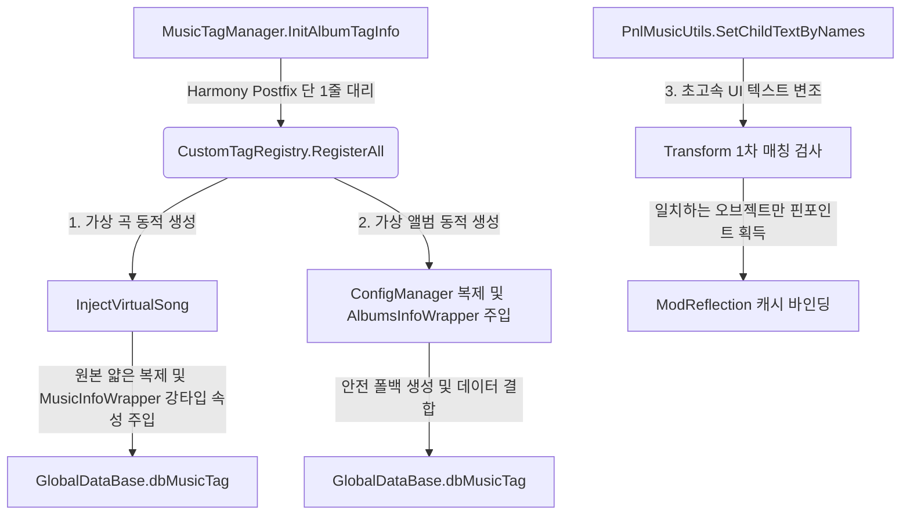

# 🎵 캐스트 추상화 및 커스텀 태그 동적 주입 가이드 (Cast & Custom Tag Guide)

본 가이드는 뮤즈대시 모드 내에서 타입 결합도(Coupling)를 차단하기 위한 **유니버설 래퍼 패턴(Universal Wrapper Pattern)** 프레임워크와, 이를 기반으로 구현된 **커스텀 태그(실험 모드) 및 가상 곡/앨범 동적 주입** 시스템의 아키텍처 및 소스 코드 연동 원리를 상세히 설명합니다.

---

## 1. 🏗️ 아키텍처 개요 (Architecture Overview)

전체 시스템은 비즈니스 로직과 Harmony 패치 레이어가 철저히 격리(Decoupling)되어 작동합니다.



---

## 2. 💎 유니버설 래퍼 패턴 및 동적 캐스트 (Universal Wrapper & Dynamic Cast)

IL2CPP 게임 런타임 객체(`MusicInfo`, `AlbumsInfo` 등)를 조작할 때 발생할 수 있는 런타임 예외와 패치/업데이트 시의 변수명 변경 폭사를 방지하기 위해 추상화 계층을 탑재했습니다.

### 2.1 [Il2CppWrapperBase.cs](file:///H:/source/repos/muse%20dash%20test/muse%20dash%20test/Patches/UI/Common/Il2CppWrapperBase.cs) (공용 추상 베이스)
모든 IL2CPP 래퍼의 부모 클래스로, 공통 리플렉션 호출을 캡슐화합니다.
* **`RawObject`**: 실제 IL2CPP가 메모리에 생성한 네이티브 객체 참조를 보존합니다.
* **`Get<T>(string memberName, bool silent)`**: `ModReflection.GetValue`를 통해 대상의 멤버 값을 안전하게 읽어온 뒤 C# 제네릭 타입으로 캐스팅하여 반환합니다.
* **`Set<T>(string memberName, T value, bool silent)`**: `ModReflection.SetValue`와 연동되어 고속 캐싱 리플렉션을 통해 대상 속성에 값을 안전하게 주입합니다.
* **`AddMaskValue(string key, object value)`**: 딕셔너리 기반의 IL2CPP 마스크 메타데이터에 안전하게 값을 주입합니다.

### 2.2 [ModReflection.cs](file:///H:/source/repos/muse%20dash%20test/muse%20dash%20test/Patches/UI/Common/ModReflection.cs) (고성능 리플렉션 캐싱 엔진)
게임 라이브러리가 업데이트되거나 난독화가 바뀌더라도 코드가 부러지지 않게 해주는 핵심 지능형 리플렉션 엔진입니다.
* **`ResolveMember` 최적화**: 
  1. 정확한 프로퍼티명 매칭
  2. 정확한 필드명 매칭
  3. 컴파일러 백킹 필드 자동 스캔 (`_[name]_k__BackingField`)
  4. Unity/PeroTools 접두사 스캔 (`m_[name]`, `m_[Name]`)
  5. 대소문자 무시(Case-Insensitive) 전체 매칭 폴백
* **초고속 바이패스 필터 가드**: 
  * 텍스트 속성이 존재할 리 없는 대표적인 Unity 내장 컴포넌트(`Transform`, `CanvasRenderer`, `Image`, `Mask`, `Shader` 등)에 대해 `text` 멤버 조회를 시도하면 즉시 `null`을 반환하여 CPU 연산 낭비를 차단합니다.

### 2.3 구체화된 래퍼 자식 클래스들
* **[MusicInfoWrapper.cs](file:///H:/source/repos/muse%20dash%20test/muse%20dash%20test/Patches/UI/Common/MusicInfoWrapper.cs)**: 곡 정보를 담는 `MusicInfo` 전용 래퍼로 `uid`, `name`, `author`, `levelDesigner`, `difficulty` 등의 속성을 강타입 속성(Property)으로 변환해 제공합니다.
* **[AlbumsInfoWrapper.cs](file:///H:/source/repos/muse%20dash%20test/muse%20dash%20test/Patches/UI/Common/AlbumsInfoWrapper.cs)**: 가상 앨범 데이터를 다루기 위한 `DBConfigAlbums.AlbumsInfo` 전용 래퍼로 `uid`, `title`, `tag`, `free` 등을 노출합니다.

---

## 3. 🏷️ 커스텀 태그 및 가상 곡/앨범 동적 주입 (Custom Tag & Registry)

[CustomTagRegistry.cs](file:///H:/source/repos/muse%20dash%20test/muse%20dash%20test/Patches/UI/Custom/CustomTagRegistry.cs) 클래스는 커스텀 카테고리(실험 모드)를 동적으로 이식하는 일련의 시퀀스를 지휘합니다.

### 3.1 태그 탭 생성 및 다국어 지원
`RegisterAll` 메소드 진입 시 영어, 한국어, 일본어, 중국어 등 태그 탭의 명칭을 `Il2CppSystem.Collections.Generic.Dictionary`로 래핑하여 주입합니다.
```csharp
var info = new AlbumTagInfo
{
    name = "Experiment Mod",
    tagUid = "tag-muse-dash-test",
    iconName = "IconCustomAlbums" // 커스텀 앨범 전용 기본 아이콘
};
```

### 3.2 가상 곡 동적 생성 및 얇은 복제 (Thin Clone)
`InjectVirtualSong`을 통해 선선택된 원본 곡(`Memory of Beach` 등)을 `MemberwiseClone()`으로 복제합니다.
* **왜 얇은 복제를 수행하나요?**
  * PeroTools 내부적으로 사용하는 클래스 인메모리 포인터와 기본값 데이터 구조를 100% 안전하게 유지하기 위해서입니다. 무에서 새로운 객체를 `new`로 생성하면 메모리가 어긋나 강제 종료를 유발할 수 있습니다.
* 복제된 `MusicInfo`에 `MusicInfoWrapper`를 씌워 가상 곡의 메타데이터(`999-0`, `999-1`, `999-2`)와 곡 이름 및 작곡가를 재기입합니다.
* 완성된 가상 곡들은 글로벌 데이터베이스의 `m_AllMusicInfo` 맵에 최종적으로 신규 주입하여 바인딩을 형성합니다.

### 3.3 가상 앨범 생성 및 안전 폴백 (Safety Fallback)
* `DBConfigAlbums` 설정 데이터 내의 `m_Items` 리스트에 우리의 가상 앨범(`998-0`, 타이틀: `실험 앨범`, 소속 태그: `tag-muse-dash-test`)을 복제 주입합니다.
* **복제 실패 대비 폴백 가드**:
  * 만약 게임 엔진 내의 얇은 복제가 예외를 일으킬 시, 즉시 `new DBConfigAlbums.AlbumsInfo()` 인스턴스를 수동 생성하고 `AlbumsInfoWrapper`로 감싸 데이터를 주입하는 안전 폴백 객체를 형성하여 모드를 에러로부터 복구합니다.

---

## 4. 🎛️ 패치 분리 및 인터셉트 레이어 (Decoupled Patches)

실제 Harmony 패치들은 비즈니스 코드를 가지지 않고 훅 매개체 역할만 수행합니다.

* **[CustomTagPatch.cs](file:///H:/source/repos/muse%20dash%20test/muse%20dash%20test/Patches/UI/Custom/CustomTagPatch.cs)**:
  ```csharp
  [HarmonyPatch(typeof(MusicTagManager), nameof(MusicTagManager.InitAlbumTagInfo))]
  internal partial class MusicTagPatch
  {
      private static void Postfix(MusicTagManager __instance)
      {
          // 비즈니스 로직을 모듈러 레지스트리로 이송하여 단 1줄로 초슬림 위임
          CustomTagRegistry.RegisterAll(__instance);
      }
  }
  ```
* **[CustomTagPatch.AlbumPatches.cs](file:///H:/source/repos/muse%20dash%20test/muse%20dash%20test/Patches/UI/Custom/CustomTagPatch.AlbumPatches.cs)**:
  * 곡 선택이나 상세 화면 로드 시 게임 엔진이 해당 가 가상 앨범(`998-0`)에 소속된 것임을 알아챌 수 있도록 `GetAlbumInfoByMusicInfo`, `GetAlbumsInfoByUid`, `GetAlbumIndexByUid` 메서드가 호출될 때 중간에서 가로채(Prefix) 우리의 `CustomTagRegistry.CustomAlbumInfo` 참조로 우회시켜 반환해 주는 인터셉트 컨트롤러 역할을 수행합니다.

---

## 5. 🛠️ 확장 및 변형 개발자 가이드 (Developer Extension)

### 5.1 새로운 가상 곡을 추가하고 싶을 때
[CustomTagRegistry.cs](file:///H:/source/repos/muse%20dash%20test/muse%20dash%20test/Patches/UI/Custom/CustomTagRegistry.cs) 파일 내의 `RegisterAll` 메소드 중간 지점(가상 곡 주입부)에 다음과 같이 신규 가상 곡 호출을 한 줄 적어넣으시면 즉시 적용됩니다.

```csharp
// "999-3" 가상 곡 신규 추가 예시
InjectVirtualSong(
    originalInfo, 
    "999-3",              // 가상 곡 고유 UID
    "새로운 실험곡 3",       // 표시될 곡 제목
    "작곡가 이름",          // 아티스트 명
    "레벨 디자이너",         // 디자이너 명
    "iyaiya_cover",       // 커버 아트 프리팹
    "iyaiya_map",         // 노트 배치 JSON 리소스명
    "iyaiya_music",       // 오디오 클립 리소스명
    3, 6,                 // 난이도 (이지, 하드 등)
    musicList             // 등록 리스트 컨텍스트
);
```

이후 MSBuild/build.bat 빌드 시 즉시 동적으로 생성되어 게임의 "실험 모드" 태그 탭 아래에 노출됩니다!
