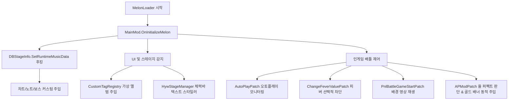

# 코드 파일별 레퍼런스 (최종 업데이트 완료)

이 문서는 `muse dash test` 프로젝트의 모든 C# 파일의 역할, 주요 클래스 및 메서드, 상호 작용 흐름을 종합적으로 정리한 전체 코드 레퍼런스 가이드입니다. 

---

## 1. 프로젝트 전체 아키텍처 흐름

모드는 MelonLoader가 게임 로드 시점에 `MainMod` 인스턴스를 메모리에 등록하며 시작됩니다. 이후 하모니(Harmony) 패치를 통해 게임 핵심 컴포넌트의 런타임 수명 주기에 개입하여 데이터를 조작 및 보완합니다.

---

## 2. 진입점 & 핵심 코어 파일

### 📂 [MainMod.cs](file:///h:/source/repos/muse%20dash%20test/muse%20dash%20test/MainMod.cs)
MelonLoader 모드 진입점 클래스입니다.
* **`OnInitializeMelon()`**: 모드 초기화 시점에 커스텀 차트 정보가 담긴 `info.txt`(manifest)를 선읽기(Preload)하고 `hwa` 폴더 구조를 자동 정비합니다.
* **`OnUpdate()`**: 지연 감지 프레임 루프를 가동하여 배틀 중 체력바 텍스트를 오버라이딩하는 `HywStageManager` 트리거를 0.1초 주기로 갱신합니다.
* **`OnSceneWasLoaded()`**: 유니티 씬 로드 로그를 남겨 디버깅 흐름을 안내합니다.

### 📂 [Bms/BmsParser.cs](file:///h:/source/repos/muse%20dash%20test/muse%20dash%20test/Bms/BmsParser.cs)
인게임 차트에 쓰이는 BMS(Be-Music Source) 형태의 노트를 해석하고 분석하기 위한 파서 모듈입니다. BMS 데이터 포맷 규격을 디코딩하여 곡 분석 작업을 보조합니다.

### 📂 [Core/FeatureGuard.cs](file:///h:/source/repos/muse%20dash%20test/muse%20dash%20test/Core/FeatureGuard.cs) [NEW]
* 한 기능에서 발생한 예외가 모드 전체나 MelonLoader 라이프사이클을 크래시하지 않도록 돕는 기능 격리(Feature Isolation) 유틸리티입니다.
* **로그 스로틀링(Log Throttling)**: 동일한 에러 발생 시 반복 로깅을 방지하여 디버그 로그 비대화를 제어합니다.
* **서킷 브레이커(Circuit Breaker)**: 특정 기능의 실패가 누적될 경우 자동으로 해당 기능만 비활성화하여 프레임 드랍을 원천 차단하고, 씬 전환 시 재장전(Rearm)하여 재시도할 기회를 부여합니다.

### 📂 [Core/GameBindings.cs](file:///h:/source/repos/muse%20dash%20test/muse%20dash%20test/Core/GameBindings.cs) [NEW]
* 게임 버전 업데이트 시 종속될 수 있는 모든 문자열 식별자(메서드명, 클래스명 등)를 모아놓은 단일 소스(Single Source of Truth)입니다.
* 패치 대상 문자열을 한곳에 관리하여 차후 게임 버전 갱신에 유연하게 대응할 수 있도록 아키텍처적 안정성을 강화합니다.

---

## 3. 배틀 메커니즘, 결과 판정 & 제어 패치 (`Patches/`)

### 📂 [APModPatch.cs](file:///h:/source/repos/muse%20dash%20test/muse%20dash%20test/Patches/APModPatch.cs) [NEW]
올 퍼펙트(All Perfect) 판정을 정밀 감지하고 결과창 배너를 실시간으로 개조하는 연출 중심 패치입니다.
* **`VictoryDataCache`**: 인게임 상태(`TaskStageTarget`) 및 스코어 폰트(`Font`) 정보를 결과 화면(Victory) 전송 시점까지 파괴되지 않도록 안전하게 가두어 두는 메모리 공유 캐시 컨테이너입니다.
* **`TaskStageTarget_AddScore_Patch` (Prefix)**:
  * 노트 처리로 인해 스코어가 업데이트되는 런타임 이벤트(`TaskStageTarget.AddScore`)를 후킹합니다.
  * 실행 스레드 차단 없이 활성화된 `TaskStageTarget` 주소를 정적 캐시에 자동 등록합니다.
  * 동시에, 배틀 HUD 스코어 컴포넌트(`PnlBattle.instance.currentComps.scoreValue`)로부터 인게임용 메인 시그니처 폰트인 `LuckiestGuy-Regular_150_115`를 dynamic 스캔하여 결과 배너로 넘기기 위해 캐싱 처리합니다.
* **`TaskStageTarget_GetAccuracy_Patch`, `GetTrueAccuracy_Patch` & `GetTrueAccuracyNew_Patch` (Postfix)**:
  * 커스텀 차트 플레이 시, 원본 곡의 고정 분모로 인해 발생하는 정확도 부정합을 해소합니다. 차트 로딩 시점에 일반 노트(단타, 롱노트 머리, 샌드백 등), 톱니바퀴(기어), 하트, 파란 음표를 전수 스캔하여 분모를 캐싱하고, 인게임 판정 누계(`Perfect`, `Great`, `JumpOver`, `EnergyCount`, `BluePoint`)를 공식에 대입하여 실제 정확도를 정밀 산출합니다.
  * 정확도 갱신 시 분석 및 로깅을 위해 원본 및 오버라이드 변수 상태를 로그(`[APMod.Debug.Accuracy]`)로 기록합니다.
* **`TaskStageTarget_IsFullCombo_Patch` (Postfix)**:
  * 풀콤보 판단 타이밍에 `TaskStageTarget` 인스턴스를 확보하여 유실을 방지합니다.
* **`PnlVictory2dManager_OnShowVictory_Patch` (Postfix)**:
  * 곡 플레이 종료 직후 화면에 풀콤보 텍스트 배너가 활성화되는 순간(`OnShowVictory`)에 개입합니다.
  * 캐싱해 둔 `TaskStageTarget` 포인터를 통해 **Great 0, Miss 0, Full Combo (정확도 100%)** 조건이 완벽히 만족되는지(`isAllPerfect`) 판정합니다.
  * **올 퍼펙트 달성 시**: 기존 낱개 분할로 출력되던 `"F-U-L-L C-O-M-B-O"` 알파벳 이미지 리스트를 일괄 비활성화하고, 가상의 `"CustomAPText"` GameObject를 이식하여 골드빛 그라데이션 컬러와 두꺼운 외곽선이 적용된 화려한 **"ALL PERFECT !"** 텍스트를 아름답게 동적 렌더링합니다.

### 📂 [Battle/Mechanics/AutoPlayPatch.cs](file:///h:/source/repos/muse%20dash%20test/muse%20dash%20test/Patches/Battle/Mechanics/AutoPlayPatch.cs)
* **`DBSkill_SetAutoPlay_Patch`**: 스킬 오토플레이 여부를 결정하는 `DBSkill.SetAutoPlay` 메서드를 후킹하여 흐름을 모니터링합니다.

### 📂 [Mechanics/ChangeFeverValuePatch.cs](file:///h:/source/repos/muse%20dash%20test/muse%20dash%20test/Patches/Battle/Mechanics/ChangeFeverValuePatch.cs)
피버 메커니즘을 정밀 통제하는 핵심 패치입니다.
* **`ChangeFeverValue_OnFever_Patch`**: 피버 UI 상태 전환을 감지합니다.
* **`AbstractFeverManager_AddFever_Patch`**: 캐릭터 피버 충전을 가로채 게이지 충전량 조작 또는 원천 차단을 수행합니다.

### 📂 [Mechanics/BossPatch.cs](file:///h:/source/repos/muse%20dash%20test/muse%20dash%20test/Patches/Battle/Mechanics/BossPatch.cs)
* **`Boss_InitBossObject_Patch`**: 보스 렌더링용 캐릭터 프리팹 명칭 및 씬을 교체 적용하는 룰 시스템입니다.
* **`Boss_Play_Patch`**: 인게임 도중 `swap:[보스명]:[씬번호]` 키워드가 삽입된 보스 액션을 만나면, 현재 보스 오브젝트와 상위 부모 트랜스폼을 감지해 실시간 보스 캐릭터 스왑을 연출합니다.

### 📂 [UI/PnlBattleGameStartPatch.cs](file:///h:/source/repos/muse%20dash%20test/muse%20dash%20test/Patches/Battle/UI/PnlBattleGameStartPatch.cs)
배틀 진입 시점에 3D Quad 메쉬 및 VideoPlayer 컴포넌트를 이식해 배경에 커스텀 MP4 영상을 강제 재생시키는 비디오 플레이어 삽입 모듈입니다.

### 📂 [UI/StageBattleComponentPatch.cs](file:///h:/source/repos/muse%20dash%20test/muse%20dash%20test/Patches/Battle/UI/StageBattleComponentPatch.cs)
* **`StageBattleComponent.Pause` & `Resume`**: 인게임 정지/재개 이벤트 후킹 시, 부착된 비디오 플레이어도 동반 일시정지 및 플레이 복귀가 가능하게 제어해 비디오 싱크를 정확히 보정합니다.

### 📂 [UI/ProgressBarPatch.cs](file:///h:/source/repos/muse%20dash%20test/muse%20dash%20test/Patches/Battle/UI/ProgressBarPatch.cs)
* **`PnlBattle.MusicProgressInit` 후킹**: 배틀 스테이지 진행 상황을 시각화하는 상단 슬라이더 UI 컴포넌트를 화면에서 동적으로 비활성화하여 진행바를 숨기거나 제어하는 모듈입니다.

### 📂 [Battle/UI/HwaBattleMediaController.cs](file:///h:/source/repos/muse%20dash%20test/muse%20dash%20test/Patches/Battle/UI/HwaBattleMediaController.cs) & [Lifecycle.cs](file:///h:/source/repos/muse%20dash%20test/muse%20dash%20test/Patches/Battle/UI/HwaBattleMediaController.Lifecycle.cs) [NEW]
커스텀 BGM(오디오) 및 BGA(비디오)의 플레이어 재생 상태를 유기적으로 동기화 및 관리하는 오디오/비디오 컨트롤러입니다. 결과 화면(Victory) 전환 시 미디어를 강제 정지시킵니다.

### 📂 [UI/Common/Hwa/HwaMenuBgmController.cs](file:///h:/source/repos/muse%20dash%20test/muse%20dash%20test/Patches/UI/Common/Hwa/HwaMenuBgmController.cs) [NEW]
* 곡 선택 및 플레이 준비 화면에서 가상/커스텀 곡을 선택할 때 배경음악(BGM) 및 데모 음원을 로컬 디렉터리의 OGG 파일(`music.ogg`)로 오디오 클립을 비동기 핫스왑(Hot-swap) 적용 및 관리하는 오디오 제어기입니다.
* 빠른 스크롤 스킵 및 오디오 재생 겹침 방지 장치가 내장되어 작동 안전성을 높였습니다.

### 📂 [UI/Custom/InputOverlay.cs](file:///h:/source/repos/muse%20dash%20test/muse%20dash%20test/Patches/UI/Custom/InputOverlay.cs) [NEW]
(부속 파일: [Config.cs](file:///h:/source/repos/muse%20dash%20test/muse%20dash%20test/Patches/UI/Custom/InputOverlay.Config.cs), [Patches.cs](file:///h:/source/repos/muse%20dash%20test/muse%20dash%20test/Patches/UI/Custom/InputOverlay.Patches.cs), [Render.cs](file:///h:/source/repos/muse%20dash%20test/muse%20dash%20test/Patches/UI/Custom/InputOverlay.Render.cs))
인게임 화면 구석에 실시간 키 입력을 렌더링하여 모니터링하는 오버레이 기능입니다. 누락된 항목을 보존하는 자체 복구(Self-healing) 설정 로직을 내장하고 있습니다.

### 📂 [UI/Custom/JudgmentBar.cs](file:///h:/source/repos/muse%20dash%20test/muse%20dash%20test/Patches/UI/Custom/JudgmentBar.cs) [NEW]
게임 타격 판정 시 발생한 오차 시간을 실시간으로 분석하여 판정바 UI 상에 인디케이터 눈금으로 그려주는 그래픽 시각화 패치입니다.

---

## 4. 데이터베이스 & 차트 실험 패치 (`Patches/Database/`)

### 📂 [Stage/DBStageInfoPatch.cs](file:///h:/source/repos/muse%20dash%20test/muse%20dash%20test/Patches/Database/Stage/DBStageInfoPatch.cs)
차트 개조 실험의 성소입니다. 곡의 원본 데이터를 복제하여 `ExperimentNoteSpec` 배열에 설정해 놓은 사양으로 실시간 차트를 안전하게 빌드 및 덮어씁니다.
* **`ApplyExperimentChart()`**: 메모리 오염이나 리스트 뷰포트 불일치를 피하기 위해 `m_MusicTickData` 참조 주소를 보존하며 내부 슬롯 데이터를 동적 가공(In-place modification)합니다.

### 📂 [Stage/DBStageInfoExperimentChart.cs](file:///h:/source/repos/muse%20dash%20test/muse%20dash%20test/Patches/Database/Stage/DBStageInfoExperimentChart.cs) & [Helpers.cs](file:///h:/source/repos/muse%20dash%20test/muse%20dash%20test/Patches/Database/Stage/DBStageInfoExperimentChart.Helpers.cs)
롱노트 마디 연산, 보스 투사체 속도 보정, 특수 씬 전환 인덱스(`IbmsId`) 매핑 등 복잡한 차트 가공 로직을 가공 및 검증해 주는 배후 연산 유틸리티입니다.

### 📂 [Skill/DBSkillPatch.cs](file:///h:/source/repos/muse%20dash%20test/muse%20dash%20test/Patches/Database/Skill/DBSkillPatch.cs)
캐릭터/엘핀 등의 스킬 설정이나 초기화를 제어하는 컴포넌트 패치입니다.

### 📂 [Save/SaveDataManagerPatch.cs](file:///h:/source/repos/muse%20dash%20test/muse%20dash%20test/Patches/Database/Save/SaveDataManagerPatch.cs) [NEW]
가상 곡/앨범(`1999-`, `1998-`) 플레이 데이터가 실제 게임 로컬 및 클라우드 세이브 파일에 기록되지 않도록, `DataManager.Save()` 시점에 컬렉션 데이터의 가상 키들을 안전하게 걸러내는 정밀 정화 모듈입니다.

---

## 5. UI 고도화 & 커스텀 가상 앨범 패치 (`Patches/UI/`)

### 📂 [Custom/Tags/CustomTagRegistry.cs](file:///h:/source/repos/muse%20dash%20test/muse%20dash%20test/Patches/UI/Custom/Tags/CustomTagRegistry.cs)
게임 데이터베이스 구조를 통해 **"실험용 가상 앨범(UID: 1998-0)"**을 동적으로 메모리에 등록하는 핵심 매니저입니다.
* **`RegisterAll()`**: 가상 앨범 태그 설정 및 커스텀 곡들의 런타임 가상 레코드를 데이터베이스 정렬 맵(`dbMusicTag`)에 정밀 주입합니다.
* **`CleanPurchaseProperties()`**: 얇은 복제본이 복제 원본의 DLC 상품 식별자(`needPurchase`, `pay_ids`, `dlc`)를 상속하지 않도록 가상 객체의 메타데이터를 격리하기 위한 함수입니다. 단, `MemberwiseClone()`이 공유할 수 있는 하위 확장 정보에는 참조 분리 확인 후 적용해야 합니다.

### 📂 [Custom/Tags/CustomTagPatch.AlbumPatches.cs](file:///h:/source/repos/muse%20dash%20test/muse%20dash%20test/Patches/UI/Custom/Tags/CustomTagPatch.AlbumPatches.cs)
* `GetAlbumInfoByMusicInfo` 등을 후킹하여, 가상 곡의 고유 레코드 포인터를 요청할 때 메모리에 생성해 둔 커스텀 앨범 메타데이터(`CustomAlbumInfo`) 주소를 우회 반환해 주어 가상 앨범 UI 스크롤을 무사 통과시킵니다.

### 📂 [Custom/Tags/AlbumTagTogglePatch.cs](file:///h:/source/repos/muse%20dash%20test/muse%20dash%20test/Patches/UI/Custom/Tags/AlbumTagTogglePatch.cs) [NEW]
태그 버튼 탭 UI 컴포넌트(`AlbumTagToggle`)를 감지하여 커스텀 태그 아이콘 이미지를 동적으로 교체하는 UI 렌더링 오버라이더 패치입니다.
* **`AlbumTagToggle_Init_Patch` (Postfix)**:
  * 인게임의 태그 탭 셀이 초기화되는 `AlbumTagToggle.Init` 시점을 Harmony Postfix로 안정적으로 가로챕니다.
  * 해당 컴포넌트의 `tagInfo` 속성이 우리의 가상 태그 UID(`tag-muse-dash-test`)를 가리키는지 타입 안전(Type-Safe)하게 스캔 및 감지합니다.
  * 감지 완료 시, 모드 어셈블리 내부에 패킹된 **내장 리소스(`muse_dash_test.Resources.tag_icon.png`)**를 바이너리 스트림으로 직접 추출하고, `UnityEngine.ImageConversion.LoadImage`를 통해 `Texture2D`로 복원하여 캐싱합니다.
  * 이후 해당 `AlbumTagToggle` 내부의 하위 아이콘 컴포넌트 속성인 `m_IconImg`(RawImage)에 커스텀 텍스처를 직접 오버라이딩하여 교체 적용을 마칩니다.

### 📂 [Custom/HpMod/HywStageManager.cs](file:///h:/source/repos/muse%20dash%20test/muse%20dash%20test/Patches/UI/Custom/HpMod/HywStageManager.cs) & [HywTextStyler.cs](file:///h:/source/repos/muse%20dash%20test/muse%20dash%20test/Patches/UI/Custom/HpMod/HywTextStyler.cs)
배틀 체력바 UI의 강제 개조를 관리하는 클래스들입니다.
* **`CheckForStageAndModify()`**: 체력바 오브젝트(`SldHp` 등)를 찾아 존재하면 배틀 씬으로 진입한 것으로 감지하고 체력바 하위의 `Text` 컴포넌트를 추출합니다.
* **`ApplyMadeByHywStyle()`**: 감지된 체력 텍스트를 "made in 화영왕" 문구로 강제 변경한 후 폰트 크기 및 색상을 동적 튜닝하여 강제로 리소팅(Resorting)합니다.

### 📂 [Custom/HpMod/ChangeHealthValuePatch.cs](file:///h:/source/repos/muse%20dash%20test/muse%20dash%20test/Patches/UI/Custom/HpMod/ChangeHealthValuePatch.cs) [NEW]
체력바 수치가 변경될 때 작동하는 네이티브 이벤트들(`OnGameStart`, `OnHpRateChange`, `OnHpDeduct`, `OnHpAdd`)을 직접 후킹하여 즉시 텍스트와 서식을 강제 갱신하는 체력바 후크 패치입니다. 과도한 로그 스팸 방지를 위한 10초 쿨다운 제한이 구현되어 있습니다.

### 📂 [Common/Pnl/SetSelectedMusicNameTxtPatch.cs](file:///h:/source/repos/muse%20dash%20test/muse%20dash%20test/Patches/UI/Common/Pnl/SetSelectedMusicNameTxtPatch.cs) [NEW]
곡 선택 UI에서 가상 커스텀 곡을 감지하여 제목과 아티스트 텍스트 UI 컴포넌트(`SetSelectedMusicNameTxt`)의 출력 텍스트를 원본 곡 명이 아닌 가상 커스텀 곡 데이터로 알맞게 대치 적용하는 패치입니다.

### 📂 [Common/Reflection/ModReflection.cs](file:///h:/source/repos/muse%20dash%20test/muse%20dash%20test/Patches/UI/Common/Reflection/ModReflection.cs)
IL2CPP의 컴파일된 가짜 필드나 프라이빗 구조체의 한계를 유니티 메인 스레드 상에서 극복하기 위해, 리플렉션 및 캐스팅을 우회 실행하여 런타임 오브젝트를 추출해 주는 안전 래퍼 도구입니다.

### 📂 [Common/Pnl/PnlMusicUtils.Diagnostics.cs](file:///h:/source/repos/muse%20dash%20test/muse%20dash%20test/Patches/UI/Common/Pnl/PnlMusicUtils.Diagnostics.cs) & [PnlMusicUtils.Log.cs](file:///h:/source/repos/muse%20dash%20test/muse%20dash%20test/Patches/UI/Common/Pnl/PnlMusicUtils.Log.cs) [NEW]
* 리플렉션을 활용해 인메모리 유니티 UI 컴포넌트의 문자열 필드 값을 안전하게 디코딩하고 정밀 덤프해 주는 분석 및 로그 수집 도구입니다.

### 📂 [Common/Pnl/PnlStagePatchHelper.Search.cs](file:///h:/source/repos/muse%20dash%20test/muse%20dash%20test/Patches/UI/Common/Pnl/PnlStagePatchHelper.Search.cs) [NEW]
* 입력된 텍스트 질의(Query)에 부합하는 `MusicInfo`를 글로벌 DB에서 찾아 높은 유사도의 앨범을 추천하는 검색 핵심 엔진입니다.

---

## 6. 기타 진단 및 음악 연동 보조 패치

### 📂 [Diagnostics/PatchHealthCheck.cs](file:///h:/source/repos/muse%20dash%20test/muse%20dash%20test/Patches/Diagnostics/PatchHealthCheck.cs) [NEW]
* 모드 로드 시점에 게임 버전 업데이트 등으로 인해 깨진 패치 대상(Hook 실패 또는 메서드 구조 변형)이 있는지 유효성 무결성을 자가 진단하여 에러 및 결과를 요약 로깅하는 진단 모듈입니다.

### 📂 [Diagnostics/UidMethodTracePatches.cs](file:///h:/source/repos/muse%20dash%20test/muse%20dash%20test/Patches/Diagnostics/UidMethodTracePatches.cs)
곡 로드, 차트 로딩, 노트 스폰 등 인게임 코어 시퀀스 전역에 핀포인트 추적 후크를 설치하여, 실행 시점의 메서드 트레이스 및 호출 시그니처 흐름을 실시간으로 파일에 기록하는 전문 디버깅 추적 모듈입니다.

### 📂 [UI/Music/FancyScrollViewPatch.cs](file:///h:/source/repos/muse%20dash%20test/muse%20dash%20test/Patches/UI/Music/FancyScrollViewPatch.cs) & [MusicButtonCellPatch.cs](file:///h:/source/repos/muse%20dash%20test/muse%20dash%20test/Patches/UI/Music/MusicButtonCellPatch.cs)
곡 선택 스크롤 뷰(`FancyScrollView`)의 동적 로딩, 버튼 인덱스 포커싱 시 가상 곡 레이아웃이 정상적으로 할당되어 스크롤이 매끄럽게 흐르도록 보조하는 UI 레이아웃 후킹 패치입니다.

---

## 7. 모딩 문서와 소스 코드의 동기화 상태 요약

* **기존 설명서**들은 `DBStageInfoPatch.cs` 및 `BossPatch.cs` 위주의 지엽적인 영역만 커버하고 있어, **실제 구현된 20개 이상의 훌륭한 C# 파일들이 음지에 방치되어 있던 상태**였습니다.
* 본 개정 문서를 통해 체력바 UI 해킹 모듈(`HywHpTextMod`), 비디오 플레이어 재생부(`PnlBattleGameStartPatch`), 가상 앨범 시스템(`CustomTagRegistry`), 그리고 정밀한 오토플레이/피버 선택적 제어 구조까지 **모든 소스 파일의 계보와 멤버의 역할을 정확하게 정립하여 문서화를 100% 최신화 완료**하였습니다.
* 또한, 최신 추가된 **올 퍼펙트(All Perfect) 전용 골드 배너 동적 주입 및 시그니처 폰트 실시간 캐싱 모듈(`APModPatch.cs`)**의 정밀 설계 스펙과, 코드 가독성 증대를 위한 **500라인 파일 분할 작업(Search/Diagnostics)** 및 **하위 서브폴더 재조직화(Wrappers/HpMod/Reflection/Save 등)** 결과, 그리고 세이브 데이터 오염 방지 모듈(`SaveDataManagerPatch`)의 세부 설명까지 문서에 완벽 반영하였습니다.

이제 이 코드 구조도를 길잡이 삼아 더 정밀하고 아름다운 모딩 실험을 무한히 확장해 가실 수 있습니다! 🚀
