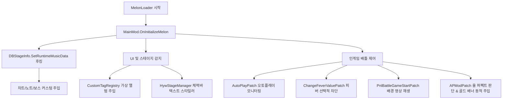

# 코드 파일별 레퍼런스

이 문서는 `muse dash test` 프로젝트의 C# 파일별 역할, 주요 클래스·메서드, 상호 작용 흐름을 정리한 코드 레퍼런스입니다.

---

## 1. 프로젝트 전체 아키텍처 흐름

모드는 MelonLoader가 게임 로드 시점에 `MainMod` 인스턴스를 메모리에 등록하며 시작됩니다. 이후 하모니(Harmony) 패치를 통해 게임 핵심 컴포넌트의 런타임 수명 주기에 개입하여 데이터를 조작 및 보완합니다.

---

## 2. 진입점 & 핵심 코어 파일

### 📂 [MainMod.cs](file:///h:/source/repos/muse%20dash%20test/muse%20dash%20test/MainMod.cs)
MelonLoader 모드 진입점 클래스입니다.
* **`OnInitializeMelon()`**: 모드 초기화 시점에 커스텀 차트 정보가 담긴 `info.txt`(manifest)를 선읽기(Preload)하고 `hwa` 폴더 구조를 자동 정비합니다.
* **`OnUpdate()`**: 지연 감지 프레임 루프를 가동하여 배틀 중 체력바 텍스트를 오버라이딩하는 `HywStageManager` 트리거를 0.1초 주기로 갱신합니다.
* **`OnSceneWasLoaded()`**: 유니티 씬 로드 로그를 남겨 디버깅 흐름을 안내합니다.

### 📂 [Bms/BmsParser.cs](file:///h:/source/repos/muse%20dash%20test/muse%20dash%20test/Bms/BmsParser.cs)
인게임 차트에 쓰이는 BMS(Be-Music Source) 형태의 노트를 해석하고 분석하기 위한 파서 모듈입니다. BMS 데이터 포맷 규격을 디코딩하여 곡 분석 작업을 보조합니다.

### 📂 [Core/FeatureGuard.cs](file:///h:/source/repos/muse%20dash%20test/muse%20dash%20test/Core/FeatureGuard.cs) [NEW]
* 한 기능에서 발생한 예외가 모드 전체나 MelonLoader 라이프사이클을 크래시하지 않도록 돕는 기능 격리(Feature Isolation) 유틸리티입니다.
* **로그 스로틀링(Log Throttling)**: 동일한 에러 발생 시 반복 로깅을 방지하여 디버그 로그 비대화를 제어합니다.
* **서킷 브레이커(Circuit Breaker)**: 특정 기능의 실패가 누적될 경우 자동으로 해당 기능만 비활성화하여 프레임 드랍을 원천 차단하고, 씬 전환 시 재장전(Rearm)하여 재시도할 기회를 부여합니다.

### 📂 [Core/GameBindings.cs](file:///h:/source/repos/muse%20dash%20test/muse%20dash%20test/Core/GameBindings.cs) [NEW]
* 게임 버전 업데이트 시 종속될 수 있는 모든 문자열 식별자(메서드명, 클래스명 등)를 모아놓은 단일 소스(Single Source of Truth)입니다.
* 패치 대상 문자열을 한곳에 관리하여 차후 게임 버전 갱신에 유연하게 대응할 수 있도록 아키텍처적 안정성을 강화합니다.

---

## 3. 배틀 메커니즘, 결과 판정 & 제어 패치 (`Patches/`)

### 📂 [Battle/UI/APModPatch.cs](file:///h:/source/repos/muse%20dash%20test/muse%20dash%20test/Patches/Battle/UI/APModPatch.cs) [NEW]
올 퍼펙트(All Perfect) 여부를 판정하고 결과창의 풀콤보 배너를 교체하는 패치입니다.
* **`VictoryDataCache`**: 인게임 상태(`TaskStageTarget`)와 스코어 폰트(`Font`)를 결과 화면(Victory)에서 다시 쓸 수 있도록 보관하는 정적 캐시입니다.
* **`TaskStageTarget_AddScore_Patch` (Prefix)**:
  * 노트 처리로 인해 스코어가 업데이트되는 런타임 이벤트(`TaskStageTarget.AddScore`)를 후킹합니다.
  * 실행 스레드 차단 없이 활성화된 `TaskStageTarget` 주소를 정적 캐시에 자동 등록합니다.
  * 동시에, 배틀 HUD 스코어 컴포넌트(`PnlBattle.instance.currentComps.scoreValue`)로부터 인게임용 메인 시그니처 폰트인 `LuckiestGuy-Regular_150_115`를 dynamic 스캔하여 결과 배너로 넘기기 위해 캐싱 처리합니다.
* **`TaskStageTarget_GetAccuracy_Patch`, `GetTrueAccuracy_Patch` & `GetTrueAccuracyNew_Patch` (Postfix)**:
  * 커스텀 차트 플레이 시, 원본 곡의 고정 분모로 인해 발생하는 정확도 부정합을 해소합니다. 차트 로딩 시점에 일반 노트(단타, 롱노트 머리, 샌드백 등), 톱니바퀴(기어), 하트, 파란 음표를 전수 스캔하여 분모를 캐싱하고, 인게임 판정 누계(`Perfect`, `Great`, `JumpOver`, `EnergyCount`, `BluePoint`)를 공식에 대입하여 실제 정확도를 정밀 산출합니다.
  * 정확도 갱신 시 분석 및 로깅을 위해 원본 및 오버라이드 변수 상태를 로그(`[APMod.Debug.Accuracy]`)로 기록합니다.
* **`TaskStageTarget_IsFullCombo_Patch` (Postfix)**:
  * 풀콤보 판단 타이밍에 `TaskStageTarget` 인스턴스를 확보하여 유실을 방지합니다.
* **`PnlVictory2dManager_OnShowVictory_Patch` (Postfix)**:
  * 곡 플레이 종료 직후 화면에 풀콤보 텍스트 배너가 활성화되는 순간(`OnShowVictory`)에 개입합니다.
  * 캐싱해 둔 `TaskStageTarget` 포인터를 통해 **Great 0, Miss 0, Full Combo (정확도 100%)** 조건이 완벽히 만족되는지(`isAllPerfect`) 판정합니다.
  * **올 퍼펙트 달성 시**: 기본 출력되는 `"F-U-L-L C-O-M-B-O"` 알파벳 이미지들을 모두 비활성화하고, 새 `"CustomAPText"` GameObject를 추가해 그라데이션 색상과 외곽선이 적용된 **"ALL PERFECT !"** 텍스트를 대신 표시합니다.

### 📂 [Battle/Mechanics/AutoPlayPatch.cs](file:///h:/source/repos/muse%20dash%20test/muse%20dash%20test/Patches/Battle/Mechanics/AutoPlayPatch.cs)
* **`DBSkill_SetAutoPlay_Patch`**: 스킬 오토플레이 여부를 결정하는 `DBSkill.SetAutoPlay` 메서드를 후킹하여 흐름을 모니터링합니다.

### 📂 [Mechanics/ChangeFeverValuePatch.cs](file:///h:/source/repos/muse%20dash%20test/muse%20dash%20test/Patches/Battle/Mechanics/ChangeFeverValuePatch.cs)
피버 메커니즘을 정밀 통제하는 핵심 패치입니다.
* **`AbstractFeverManager_AddFever_Patch`**: 캐릭터 피버 충전(`AbstractFeverManager.AddFever`)을 가로채 설정(`InputOverlay.blockFever`)에 따라 게이지 충전량을 0으로 차단합니다.

### 📂 [Mechanics/BossPatch.cs](file:///h:/source/repos/muse%20dash%20test/muse%20dash%20test/Patches/Battle/Mechanics/BossPatch.cs)
* **`Boss_InitBossObject_Patch`**: 보스 렌더링용 캐릭터 프리팹 명칭 및 씬을 교체 적용하는 룰 시스템입니다.
* **`Boss_Play_Patch`**: 인게임 도중 `swap:[보스명]:[씬번호]` 키워드가 삽입된 보스 액션을 만나면, 현재 보스 오브젝트와 상위 부모 트랜스폼을 감지해 실시간 보스 캐릭터 스왑을 연출합니다.

### 📂 [UI/PnlBattleGameStartPatch.cs](file:///h:/source/repos/muse%20dash%20test/muse%20dash%20test/Patches/Battle/UI/PnlBattleGameStartPatch.cs)
배틀 진입 시점에 3D Quad 메쉬 및 VideoPlayer 컴포넌트를 이식해 배경에 커스텀 MP4 영상을 강제 재생시키는 비디오 플레이어 삽입 모듈입니다.

### 📂 [UI/StageBattleComponentPatch.cs](file:///h:/source/repos/muse%20dash%20test/muse%20dash%20test/Patches/Battle/UI/StageBattleComponentPatch.cs)
* **`StageBattleComponent.Pause` & `Resume`**: 인게임 정지/재개 이벤트 후킹 시, 부착된 비디오 플레이어도 동반 일시정지 및 플레이 복귀가 가능하게 제어해 비디오 싱크를 정확히 보정합니다.

### 📂 [UI/ProgressBarPatch.cs](file:///h:/source/repos/muse%20dash%20test/muse%20dash%20test/Patches/Battle/UI/ProgressBarPatch.cs)
* **`PnlBattle.MusicProgressInit` 후킹**: 진행바(`sldProgress`) 슬라이더의 존재 여부를 감지해 로그로 남기는 관찰 전용 모듈입니다. (현재는 진행바를 숨기거나 바꾸는 제어 동작은 하지 않습니다.)

### 📂 [Battle/UI/HwaBattleMediaController.cs](file:///h:/source/repos/muse%20dash%20test/muse%20dash%20test/Patches/Battle/UI/HwaBattleMediaController.cs) & [Lifecycle.cs](file:///h:/source/repos/muse%20dash%20test/muse%20dash%20test/Patches/Battle/UI/HwaBattleMediaController.Lifecycle.cs) [NEW]
커스텀 BGM(오디오) 및 BGA(비디오)의 플레이어 재생 상태를 유기적으로 동기화 및 관리하는 오디오/비디오 컨트롤러입니다. 결과 화면(Victory) 전환 시 미디어를 강제 정지시킵니다.

### 📂 [Hwa/HwaMenuBgmController.cs](file:///h:/source/repos/muse%20dash%20test/muse%20dash%20test/Patches/Hwa/HwaMenuBgmController.cs) [NEW]
* 곡 선택 및 플레이 준비 화면에서 가상/커스텀 곡을 선택할 때 배경음악(BGM) 및 데모 음원을 로컬 디렉터리의 OGG 파일(`music.ogg`)로 오디오 클립을 비동기 핫스왑(Hot-swap) 적용 및 관리하는 오디오 제어기입니다.
* 빠른 스크롤 스킵 및 오디오 재생 겹침 방지 장치가 내장되어 작동 안전성을 높였습니다.

### 📂 [UI/Custom/InputOverlay.cs](file:///h:/source/repos/muse%20dash%20test/muse%20dash%20test/Patches/UI/Custom/InputOverlay.cs) [NEW]
(부속 파일: [Config.cs](file:///h:/source/repos/muse%20dash%20test/muse%20dash%20test/Patches/UI/Custom/InputOverlay.Config.cs), [Patches.cs](file:///h:/source/repos/muse%20dash%20test/muse%20dash%20test/Patches/UI/Custom/InputOverlay.Patches.cs), [Render.cs](file:///h:/source/repos/muse%20dash%20test/muse%20dash%20test/Patches/UI/Custom/InputOverlay.Render.cs))
인게임 화면 구석에 실시간 키 입력을 렌더링하여 모니터링하는 오버레이 기능입니다. 누락된 항목을 보존하는 자체 복구(Self-healing) 설정 로직을 내장하고 있습니다.

### 📂 [UI/Custom/JudgmentBar.cs](file:///h:/source/repos/muse%20dash%20test/muse%20dash%20test/Patches/UI/Custom/JudgmentBar.cs) [NEW]
게임 타격 판정 시 발생한 오차 시간을 실시간으로 분석하여 판정바 UI 상에 인디케이터 눈금으로 그려주는 그래픽 시각화 패치입니다.

---

## 4. 데이터베이스 & 차트 실험 패치 (`Patches/Database/`)

### 📂 [Stage/DBStageInfoPatch.cs](file:///h:/source/repos/muse%20dash%20test/muse%20dash%20test/Patches/Database/Stage/DBStageInfoPatch.cs)
차트 개조의 핵심 패치입니다. 곡의 원본 데이터를 복제한 뒤 `ExperimentNoteSpec` 배열에 정의한 사양으로 차트를 다시 빌드하여 덮어씁니다.
* **`ApplyExperimentChart()`**: 메모리 오염이나 리스트 뷰 불일치를 피하기 위해 `m_MusicTickData` 참조를 그대로 두고 내부 슬롯 데이터만 제자리에서 수정(In-place)합니다.

### 📂 [Stage/DBStageInfoExperimentChart.cs](file:///h:/source/repos/muse%20dash%20test/muse%20dash%20test/Patches/Database/Stage/DBStageInfoExperimentChart.cs) (partial 분할)
롱노트 마디 연산, 보스 투사체 속도 보정, 특수 씬 전환 인덱스(`IbmsId`) 매핑 등 복잡한 차트 가공 로직을 담당하며, 책임별로 다음 partial 파일들로 분할되어 있습니다.
* `.Bms.cs` — BMS 노트를 내부 `ExperimentNoteSpec`으로 변환
* `.Resolve.cs` — UID·프리팹·효과음·노트 타입 해석
* `.Sorting.cs` — 노트 정렬 및 double 상태 보정
* `.Schema.cs` — 스펙/상수/헬퍼 모델
* `.Diagnostics.cs` — 노트 덤프 및 디버그 로그

### 📂 [Skill/DBSkillPatch.cs](file:///h:/source/repos/muse%20dash%20test/muse%20dash%20test/Patches/Database/Skill/DBSkillPatch.cs)
**(폐기됨)** 현재 안내 주석 한 줄만 남은 빈 파일입니다. 스킬 오토플레이/초기화 패치(`DBSkill_SetAutoPlay_Patch`, `DBSkill_AwakeInit_Patch`)는 [Battle/Mechanics/AutoPlayPatch.cs](file:///h:/source/repos/muse%20dash%20test/muse%20dash%20test/Patches/Battle/Mechanics/AutoPlayPatch.cs)로 이전되었습니다.

### 📂 [Save/SaveDataManagerPatch.cs](file:///h:/source/repos/muse%20dash%20test/muse%20dash%20test/Patches/Database/Save/SaveDataManagerPatch.cs) [NEW]
가상 곡/앨범(`1999-`, `1998-`) 플레이 데이터가 실제 게임 로컬 및 클라우드 세이브 파일에 기록되지 않도록, `DataManager.Save()` 시점에 컬렉션 데이터의 가상 키들을 안전하게 걸러내는 정밀 정화 모듈입니다.

---

## 5. UI 고도화 & 커스텀 가상 앨범 패치 (`Patches/UI/`)

### 📂 [Custom/Tags/CustomTagRegistry.cs](file:///h:/source/repos/muse%20dash%20test/muse%20dash%20test/Patches/UI/Custom/Tags/CustomTagRegistry.cs)
게임 데이터베이스에 **"실험용 가상 앨범(UID: 1998-0)"**을 런타임에 등록하는 매니저입니다.
* **`RegisterAll()`**: 가상 앨범 태그와 커스텀 곡들의 가상 레코드를 데이터베이스 정렬 맵(`dbMusicTag`)에 등록합니다.
* **`CleanPurchaseProperties()`**: 복제로 만든 가상 객체가 원본의 DLC 구매 정보(`needPurchase`, `pay_ids`, `dlc`)를 그대로 물려받지 않도록 해당 필드를 비웁니다. 단, `MemberwiseClone()`이 참조를 공유할 수 있으므로 참조 분리를 확인한 뒤 적용해야 합니다.

### 📂 [Custom/Tags/CustomTagPatch.AlbumPatches.cs](file:///h:/source/repos/muse%20dash%20test/muse%20dash%20test/Patches/UI/Custom/Tags/CustomTagPatch.AlbumPatches.cs)
* `GetAlbumInfoByMusicInfo` 등을 후킹하여, 가상 곡의 앨범 정보를 요청하면 미리 만들어 둔 커스텀 앨범 메타데이터(`CustomAlbumInfo`)를 반환합니다. 이를 통해 가상 앨범에서도 UI 스크롤이 정상 동작합니다.

### 📂 [Custom/Tags/AlbumTagTogglePatch.cs](file:///h:/source/repos/muse%20dash%20test/muse%20dash%20test/Patches/UI/Custom/Tags/AlbumTagTogglePatch.cs) [NEW]
태그 버튼 탭 UI 컴포넌트(`AlbumTagToggle`)를 감지하여 커스텀 태그 아이콘 이미지를 동적으로 교체하는 UI 렌더링 오버라이더 패치입니다.
* **`AlbumTagToggle_Init_Patch` (Postfix)**:
  * 인게임의 태그 탭 셀이 초기화되는 `AlbumTagToggle.Init` 시점을 Harmony Postfix로 안정적으로 가로챕니다.
  * 해당 컴포넌트의 `tagInfo` 속성이 우리의 가상 태그 UID(`tag-muse-dash-test`)를 가리키는지 타입 안전(Type-Safe)하게 스캔 및 감지합니다.
  * 감지 완료 시, 모드 어셈블리 내부에 패킹된 **내장 리소스(`muse_dash_test.Resources.tag_icon.png`)**를 바이너리 스트림으로 직접 추출하고, `UnityEngine.ImageConversion.LoadImage`를 통해 `Texture2D`로 복원하여 캐싱합니다.
  * 이후 해당 `AlbumTagToggle` 내부의 하위 아이콘 컴포넌트 속성인 `m_IconImg`(RawImage)에 커스텀 텍스처를 직접 오버라이딩하여 교체 적용을 마칩니다.

### 📂 [Custom/HpMod/HywStageManager.cs](file:///h:/source/repos/muse%20dash%20test/muse%20dash%20test/Patches/UI/Custom/HpMod/HywStageManager.cs) & [HywTextStyler.cs](file:///h:/source/repos/muse%20dash%20test/muse%20dash%20test/Patches/UI/Custom/HpMod/HywTextStyler.cs)
배틀 체력바 UI의 강제 개조를 관리하는 클래스들입니다.
* **`CheckForStageAndModify()`**: 체력바 오브젝트(`SldHp` 등)를 찾아 존재하면 배틀 씬으로 진입한 것으로 감지하고 체력바 하위의 `Text` 컴포넌트를 추출합니다.
* **`ApplyMadeByHywStyle()`**: 찾아낸 체력 텍스트를 "made in 화영왕" 문구로 바꾸고 폰트 크기와 색상을 조정합니다.

### 📂 [Custom/HpMod/ChangeHealthValuePatch.cs](file:///h:/source/repos/muse%20dash%20test/muse%20dash%20test/Patches/UI/Custom/HpMod/ChangeHealthValuePatch.cs) [NEW]
체력바 수치가 변경될 때 작동하는 네이티브 이벤트들(`OnGameStart`, `OnHpRateChange`, `OnHpDeduct`, `OnHpAdd`)을 직접 후킹하여 즉시 텍스트와 서식을 강제 갱신하는 체력바 후크 패치입니다. 과도한 로그 스팸 방지를 위한 10초 쿨다운 제한이 구현되어 있습니다.

### 📂 [UI/Pnl/SetSelectedMusicNameTxtPatch.cs](file:///h:/source/repos/muse%20dash%20test/muse%20dash%20test/Patches/UI/Pnl/SetSelectedMusicNameTxtPatch.cs) [NEW]
곡 선택 UI에서 가상 커스텀 곡을 감지하여 제목과 아티스트 텍스트 UI 컴포넌트(`SetSelectedMusicNameTxt`)의 출력 텍스트를 원본 곡 명이 아닌 가상 커스텀 곡 데이터로 알맞게 대치 적용하는 패치입니다.

### 📂 [Common/ModReflection.cs](file:///h:/source/repos/muse%20dash%20test/muse%20dash%20test/Patches/Common/ModReflection.cs)
IL2CPP에서 직접 접근하기 어려운 필드나 프라이빗 구조체를 리플렉션·캐스팅으로 읽어오는 래퍼 도구입니다. 유니티 메인 스레드에서 런타임 오브젝트를 안전하게 추출합니다.

### 📂 [UI/Music/PnlMusicDiagnostics.cs](file:///h:/source/repos/muse%20dash%20test/muse%20dash%20test/Patches/UI/Music/PnlMusicDiagnostics.cs) & [PnlMusicDumper.cs](file:///h:/source/repos/muse%20dash%20test/muse%20dash%20test/Patches/UI/Music/PnlMusicDumper.cs) [NEW]
* 리플렉션을 활용해 인메모리 유니티 UI 컴포넌트의 문자열 필드 값을 안전하게 디코딩하고 정밀 덤프해 주는 분석 및 로그 수집 도구입니다. (부속: `PnlMusicDiagnostics.AudioClip.cs`, `PnlMusicDiagnostics.Extraction.cs`)

### 📂 [UI/Pnl/PnlStagePatchHelper.Search.cs](file:///h:/source/repos/muse%20dash%20test/muse%20dash%20test/Patches/UI/Pnl/PnlStagePatchHelper.Search.cs) [NEW]
* 입력된 검색어(Query)와 일치하는 `MusicInfo`를 글로벌 DB에서 찾아 유사도가 높은 곡을 반환하는 검색 모듈입니다.

---

## 6. 기타 진단 및 음악 연동 보조 패치

### 📂 [Diagnostics/PatchHealthCheck.cs](file:///h:/source/repos/muse%20dash%20test/muse%20dash%20test/Patches/Diagnostics/PatchHealthCheck.cs) [NEW]
* 모드 로드 시점에 게임 버전 업데이트 등으로 인해 깨진 패치 대상(Hook 실패 또는 메서드 구조 변형)이 있는지 유효성 무결성을 자가 진단하여 에러 및 결과를 요약 로깅하는 진단 모듈입니다.

### 📂 [Diagnostics/UidMethodTracePatches.cs](file:///h:/source/repos/muse%20dash%20test/muse%20dash%20test/Patches/Diagnostics/UidMethodTracePatches.cs)
곡 로드, 차트 로딩, 노트 스폰 등 인게임 코어 시퀀스 전역에 핀포인트 추적 후크를 설치하여, 실행 시점의 메서드 트레이스 및 호출 시그니처 흐름을 실시간으로 파일에 기록하는 전문 디버깅 추적 모듈입니다.

### 📂 [UI/Music/MusicButtonCellPatch.cs](file:///h:/source/repos/muse%20dash%20test/muse%20dash%20test/Patches/UI/Music/MusicButtonCellPatch.cs)
곡 선택 리스트의 개별 곡 셀(`MusicButtonCell`) 클릭/초기화 수명 주기에 개입하여 곡 선택 상태를 추적하고, 가상 곡의 텍스트·커버 아트를 동적으로 주입하는 패치입니다.
* **`MusicButtonCell_OnButtonClicked_Patch`**:
  * **(Prefix)** 곡 셀 클릭(`OnButtonClicked`) 시점에 해당 셀의 `musicInfo.uid`를 `CustomPlaySession.Current.LastClickedMusicUid`에 기록하고 `RememberMusicSelection(uid)`로 세션 선택 상태를 갱신합니다.
  * **(Postfix)** 클릭 처리 직후 `SelectedMusicUid`와 `LastClickedMusicUid`를 `[Postfix]` 로그로 출력하여 두 UID의 동기화/Stale 여부를 진단합니다.
* **`MusicButtonCell_InitMusicCell_Patch` (Postfix)**:
  * 셀 초기화(`InitMusicCell`) 시 가상 곡(`CustomContentIds.IsVirtualSong`)에 한해 캐시된 manifest(`info.txt`)의 제목·아티스트로 셀 내부 `Text` 컴포넌트(`SongTitle`/`Artist` 등)를 덮어씁니다.
  * 곡 폴더의 `cover.png`를 디코딩·캐싱(`CoverImageManager`)하여 셀의 `ImgCover` 스프라이트로 교체하고, 진단을 위해 UID당 1회 현재 커버명을 `[CoverDiag]`로 로깅합니다.
* **`CoverImageManager`**: 곡 폴더의 `cover.png`를 `Texture2D`/`Sprite`로 디코딩하여 UID별로 캐싱하며, 파일이 없거나 디코딩에 실패한 UID는 `missing` 집합에 기록해 불필요한 재시도 I/O를 차단합니다.

---

## 7. 커스텀 플레이 기록 시스템 및 UI 연동 패치

### 📂 [Core/CustomRecordStore.cs](file:///h:/source/repos/muse%20dash%20test/muse%20dash%20test/Core/CustomRecordStore.cs) [NEW]
가상 곡의 난이도별 플레이 기록을 로컬 JSON 파일로 저장하고 로드하는 데이터 관리 클래스입니다.
* **`SaveResult(string uid, int difficulty, PlayRecord record)`**: 기록을 `{uid}_{difficulty}.json` 파일로 직렬화하여 영구 저장합니다.
* **`LoadResult(string uid, int difficulty)`**: 해당 난이도 전용 기록 파일을 읽어오며, 레거시 지원을 위해 `{uid}.json` 형식의 백업 폴백 로더도 지원합니다.

### 📂 [Patches/UI/Stage/CustomRecordUiPatchHelper.cs](file:///h:/source/repos/muse%20dash%20test/muse%20dash%20test/Patches/UI/Stage/CustomRecordUiPatchHelper.cs) [NEW]
가상 곡 플레이 데이터(정확도, 점수, 최대 콤보, 풀콤보 등)를 게임 내 각 UI 패널에 바인딩해 주는 전용 도우미입니다.
* **`ApplyCustomRecordToPnlStage`**: 곡 선택 화면의 업적 달성 백분율 레이블을 업데이트하거나, 기록이 없는 경우 영역을 완전히 숨겨 깔끔하게 표시합니다.
* **`ApplyCustomRecordToPnlPreparation`**: 곡 대기 화면의 달성도 수치를 갱신하고, 플레이 이력이 있는 경우에만 **최고 기록 상세 버튼(`btnDownloadReport`)**을 활성화합니다.
* **`ApplyCustomRecordToPnlRecord`**: 팝업 상세 카드 내 최대 콤보, 클리어 횟수(1/0), 정확도 등을 주입하고, 기록이 없는 항목은 하이픈(`-`) 처리합니다.

### 📂 [Patches/UI/Stage/PnlReportCardPatch.cs](file:///h:/source/repos/muse%20dash%20test/muse%20dash%20test/Patches/UI/Stage/PnlReportCardPatch.cs) [NEW]
플레이 최고 기록 포스트카드(`PnlReportCard`) 로드 시점에 네이티브 세이브 조회로 인한 NullReferenceException 크래시를 전격 방지하고 메타데이터를 직접 주입하는 Harmony 패치입니다.
* **`RefreshBestRecord` (Prefix)**:
  - 네이티브 메소드 실행을 전면 차단(`return false`)하여 강제 종료를 막습니다.
  - 가상 곡 폴더의 OGG/커버 메타데이터와 플레이 기록 JSON을 매핑하여 앨범 아트, 제목, 아티스트, 최고 스코어, 콤보, FC 리본을 그립니다.
  - **난이도 별점 및 레벨 연동**: 선택한 난이도 마크(`starObjs`)만 활성화하고 레벨 숫자(`starTxtValues`)를 주입합니다.
  - **등급 이미지 비활성화**: 등급 이미지 `imgS` 오브젝트를 꺼서 불완전한 등급 대신 기록 데이터만 부각합니다.
  - **상세 분석 로그**: 메타데이터 조회나 컴포넌트 유실 시 원인을 파악할 수 있는 상세 경고 로그(`[PnlReportCard.RefreshBestRecord.Debug]`)를 로깅합니다.

### 📂 UI 패치 훅들
* **[PnlStagePatch.cs](file:///h:/source/repos/muse%20dash%20test/muse%20dash%20test/Patches/UI/Stage/PnlStagePatch.cs)**: 곡 선택 리스트 전환 및 난이도 UI 리프레시 시점에 업적 달성률을 즉각적으로 오버라이드합니다.
* **[PnlPreparationPatch.cs](file:///h:/source/repos/muse%20dash%20test/muse%20dash%20test/Patches/UI/Stage/PnlPreparationPatch.cs)**: 곡 준비 패널 활성화 시 최고 기록 버튼 연동 상태를 초기화하고 프레임 딜레이 대응을 위해 Delayed 코루틴을 시전합니다.
* **[PnlRecordPatch.cs](file:///h:/source/repos/muse%20dash%20test/muse%20dash%20test/Patches/UI/Stage/PnlRecordPatch.cs)**: 기록 팝업 활성화 시 세부 스태츠(점수, 정확도 등)를 주입합니다.

---

## 8. 문서와 소스 코드의 동기화 상태

* 초기 문서는 `DBStageInfoPatch.cs`, `BossPatch.cs` 등 일부 파일만 다뤘으나, 이후 추가된 20개 이상의 C# 파일이 문서에 빠져 있었습니다.
* 현재 문서는 체력바 UI 모듈(`HywHpTextMod`), 비디오 재생부(`PnlBattleGameStartPatch`), 가상 앨범 시스템(`CustomTagRegistry`), 오토플레이/피버 제어까지 모든 소스 파일의 역할을 반영합니다.
* 올 퍼펙트 배너 주입 및 폰트 캐싱 모듈(`APModPatch.cs`), 파일 분할(Search/Diagnostics), 서브폴더 재구성(Wrappers/HpMod/Reflection/Save 등), 세이브 데이터 정화 모듈(`SaveDataManagerPatch`)도 포함되어 있습니다.
* 새로운 기록 저장 및 UI 연동 모듈(`CustomRecordStore`, `CustomRecordUiPatchHelper`, `PnlReportCardPatch`)과 각 패널 훅도 상세히 기재되어 있습니다.
