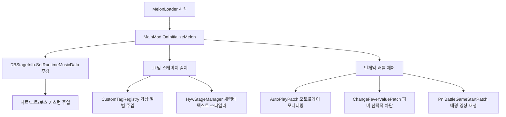

# 코드 파일별 레퍼런스 (최종 업데이트 완료)

이 문서는 `muse dash test` 프로젝트의 모든 C# 파일의 역할, 주요 클래스 및 메서드, 상호 작용 흐름을 종합적으로 정리한 전체 코드 레퍼런스 가이드입니다. 

---

## 1. 프로젝트 전체 아키텍처 흐름

모드는 MelonLoader가 게임 로드 시점에 `MainMod` 인스턴스를 메모리에 등록하며 시작됩니다. 이후 하모니(Harmony) 패치를 통해 게임 핵심 컴포넌트의 런타임 수명 주기에 개입하여 데이터를 조작 및 보완합니다.

---

## 2. 진입점 & 핵심 코어 파일

### 📂 [MainMod.cs](file:///h:/source/repos/muse%20dash%20test/muse%20dash%20test/MainMod.cs)
MelonLoader 모드 진입점 클래스입니다.
* **`OnInitializeMelon()`**: 모드 초기화 시점에 커스텀 차트 정보가 담긴 `info.txt`(manifest)를 선읽기(Preload)하고 `hwa` 폴더 구조를 자동 정비합니다.
* **`OnUpdate()`**: 지연 감지 프레임 루프를 가동하여 배틀 중 체력바 텍스트를 오버라이딩하는 `HywStageManager` 트리거를 0.1초 주기로 갱신합니다.
* **`OnSceneWasLoaded()`**: 유니티 씬 로드 로그를 남겨 디버깅 흐름을 안내합니다.

### 📂 [Bms/BmsParser.cs](file:///h:/source/repos/muse%20dash%20test/muse%20dash%20test/Bms/BmsParser.cs)
인게임 차트에 쓰이는 BMS(Be-Music Source) 형태의 노트를 해석하고 분석하기 위한 파서 모듈입니다. BMS 데이터 포맷 규격을 디코딩하여 곡 분석 작업을 보조합니다.

---

## 3. 배틀 메커니즘 & 제어 패치 (`Patches/Battle/`)

### 📂 [AutoPlayPatch.cs](file:///h:/source/repos/muse%20dash%20test/muse%20dash%20test/Patches/Battle/AutoPlayPatch.cs)
* **`DBSkill_SetAutoPlay_Patch`**: 스킬 오토플레이 여부를 결정하는 `DBSkill.SetAutoPlay` 메서드를 후킹합니다.
  * **`Prefix`**: `enable=true` 신호가 들어올 때 선택적으로 오토플레이 제어가 작동 중인지 로깅하며 흐름을 모니터링합니다. (필요 시 `enable=false`로 꺾어 인게임 키보드 조작 권한을 유지하도록 강제 제어 가능)
  * **`Postfix`**: 오토플레이 값이 최종 적용되었을 때 상태를 정확히 출력합니다.

### 📂 [ChangeFeverValuePatch.cs](file:///h:/source/repos/muse%20dash%20test/muse%20dash%20test/Patches/Battle/ChangeFeverValuePatch.cs)
피버 메커니즘을 정밀 통제하는 핵심 패치입니다.
* **`ChangeFeverValue_OnFever_Patch`**: 피버 UI 상태 전환을 감지하며, `__runOriginal` 매개변수를 통해 패치에 의한 실제 차단 여부를 로그로 왜곡 없이 식별합니다.
* **`AbstractFeverManager_AddFever_Patch`**:
  * 인게임의 모든 캐릭터 피버 클래스의 게이지 충전을 가로챕니다.
  * `typeName.Contains("GeneralFeverManager")` 필터를 통해 일반 곡의 기본 피버 매니저만 선별해 피버 게이지 충전량(`value`)을 조작하거나 원천 차단합니다.

### 📂 [BossPatch.cs](file:///h:/source/repos/muse%20dash%20test/muse%20dash%20test/Patches/Battle/BossPatch.cs)
* **`Boss_InitBossObject_Patch`**: 보스 렌더링용 캐릭터 프리팹 명칭 및 씬을 교체 적용하는 룰 시스템입니다.
* **`Boss_Play_Patch`**: 인게임 도중 `swap:[보스명]:[씬번호]` 키워드가 삽입된 보스 액션을 만나면, 현재 보스 오브젝트와 상위 부모 트랜스폼을 감지해 안전하게 강제 활성화(`SetActive(true)`) 및 **실시간 보스 캐릭터 스왑(Dynamic Boss Swap)** 연출을 수행합니다.

### 📂 [PnlBattleGameStartPatch.cs](file:///h:/source/repos/muse%20dash%20test/muse%20dash%20test/Patches/Battle/PnlBattleGameStartPatch.cs)
배틀 진입 시점에 3D Quad 메쉬 및 메쉬 렌더러를 동적 생성하고, 유니티의 `VideoPlayer` 컴포넌트를 이식해 머티리얼 오버라이드 렌더링 방식으로 배경에 커스텀 MP4 영상을 강제 재생시키는 비디오 플레이어 삽입 모듈입니다.

### 📂 [StageBattleComponentPatch.cs](file:///h:/source/repos/muse%20dash%20test/muse%20dash%20test/Patches/Battle/StageBattleComponentPatch.cs)
* **`StageBattleComponent.Pause` & `Resume`**: 인게임 정지/재개 이벤트 후킹 시, 부착된 비디오 플레이어(`VideoPlayer`)도 동반 일시정지 및 플레이 복귀가 가능하게 제어해 비디오 싱크를 정확히 보정합니다.

### 📂 [ProgressBarPatch.cs](file:///h:/source/repos/muse%20dash%20test/muse%20dash%20test/Patches/Battle/ProgressBarPatch.cs)
* **`PnlBattle.MusicProgressInit` 후킹**: 배틀 스테이지 진행 상황을 시각화하는 상단 슬라이더 UI 컴포넌트(`sldProgress`)를 성공적으로 감지하고, 해당 게임 오브젝트를 화면에서 동적으로 비활성화하여 진행바를 숨기거나 제어하는 모듈입니다.

---

## 4. 데이터베이스 & 차트 실험 패치 (`Patches/Database/`)

### 📂 [DBStageInfoPatch.cs](file:///h:/source/repos/muse%20dash%20test/muse%20dash%20test/Patches/Database/DBStageInfoPatch.cs)
차트 개조 실험의 성소입니다. 곡의 원본 데이터를 복제하여 `ExperimentNoteSpec` 배열에 설정해 놓은 사양으로 실시간 차트를 안전하게 빌드 및 덮어씁니다.
* **`ApplyExperimentChart()`**: 메모리 오염이나 리스트 뷰포트 불일치를 피하기 위해 `m_MusicTickData` 참조 주소를 보존하며 내부 슬롯 데이터를 동적 가공(In-place modification)합니다.

### 📂 [DBStageInfoExperimentChart.cs](file:///h:/source/repos/muse%20dash%20test/muse%20dash%20test/Patches/Database/DBStageInfoExperimentChart.cs) & [Helpers.cs](file:///h:/source/repos/muse%20dash%20test/muse%20dash%20test/Patches/Database/DBStageInfoExperimentChart.Helpers.cs)
롱노트 마디 연산, 보스 투사체 속도 보정, 특수 씬 전환 인덱스(`IbmsId`) 매핑 등 복잡한 차트 가공 로직을 가공 및 검증해 주는 배후 연산 유틸리티입니다.

---

## 5. UI 고도화 & 커스텀 가상 앨범 패치 (`Patches/UI/`)

### 📂 [Patches/UI/Custom/CustomTagRegistry.cs](file:///h:/source/repos/muse%20dash%20test/muse%20dash%20test/Patches/UI/Custom/CustomTagRegistry.cs)
게임 데이터베이스 구조를 뚫고 **"실험용 가상 앨범(UID: 998-0)"**을 동적으로 메모리에 우회 등록하는 핵심 매니저입니다.
* **`RegisterAll()`**: 가상 앨범 태그 설정 및 커스텀 곡들의 런타임 가상 레코드를 데이터베이스 정렬 맵(`dbMusicTag`)에 정밀 주입합니다.

### 📂 [Patches/UI/Custom/CustomTagPatch.AlbumPatches.cs](file:///h:/source/repos/muse%20dash%20test/muse%20dash%20test/Patches/UI/Custom/CustomTagPatch.AlbumPatches.cs)
* `GetAlbumInfoByMusicInfo` 등을 후킹하여, 가상 곡의 고유 레코드 포인터를 요청할 때 메모리에 생성해 둔 커스텀 앨범 메타데이터(`CustomAlbumInfo`) 주소를 우회 반환해 주어 가상 앨범 UI 스크롤을 무사 통과시킵니다.

### 📂 [Patches/UI/Custom/HywStageManager.cs](file:///h:/source/repos/muse%20dash%20test/muse%20dash%20test/Patches/UI/Custom/HywStageManager.cs) & [HywTextStyler.cs](file:///h:/source/repos/muse%20dash%20test/muse%20dash%20test/Patches/UI/Custom/HywTextStyler.cs)
배틀 체력바 UI의 강제 개조를 관리하는 클래스들입니다.
* **`CheckForStageAndModify()`**: 체력바 오브젝트(`SldHp` 등)를 찾아 존재하면 배틀 씬으로 진입한 것으로 감지하고 체력바 하위의 `Text` 컴포넌트를 추출합니다.
* **`ApplyMadeByHywStyle()`**: 감지된 체력 텍스트를 "made in 화영왕" 문구로 강제 변경한 후 폰트 크기 및 색상을 동적 튜닝하여 강제로 리소팅(Resorting)합니다.

### 📂 [Patches/UI/Common/ModReflection.cs](file:///h:/source/repos/muse%20dash%20test/muse%20dash%20test/Patches/UI/Common/ModReflection.cs)
IL2CPP의 컴파일된 가짜 필드나 프라이빗 구조체의 한계를 유니티 메인 스레드 상에서 극복하기 위해, 리플렉션 및 캐스팅을 우회 실행하여 런타임 오브젝트를 추출해 주는 안전 래퍼 도구입니다.

---

## 6. 기타 진단 및 음악 연동 보조 패치

### 📂 [Patches/Diagnostics/UidMethodTracePatches.cs](file:///h:/source/repos/muse%20dash%20test/muse%20dash%20test/Patches/Diagnostics/UidMethodTracePatches.cs)
곡 로드, 차트 로딩, 노트 스폰 등 인게임 코어 시퀀스 전역에 핀포인트 추적 후크를 설치하여, 실행 시점의 메서드 트레이스 및 호출 시그니처 흐름을 실시간으로 파일에 기록하는 전문 디버깅 추적 모듈입니다.

### 📂 [Patches/UI/Music/FancyScrollViewPatch.cs](file:///h:/source/repos/muse%20dash%20test/muse%20dash%20test/Patches/UI/Music/FancyScrollViewPatch.cs) & [MusicButtonCellPatch.cs](file:///h:/source/repos/muse%20dash%20test/muse%20dash%20test/Patches/UI/Music/MusicButtonCellPatch.cs)
곡 선택 스크롤 뷰(`FancyScrollView`)의 동적 로딩, 버튼 인덱스 포커싱 시 가상 곡 레이아웃이 정상적으로 할당되어 스크롤이 매끄럽게 흐르도록 보조하는 UI 레이아웃 후킹 패치입니다.

---

## 7. 모딩 문서와 소스 코드의 동기화 상태 요약

* **기존 설명서**들은 `DBStageInfoPatch.cs` 및 `BossPatch.cs` 위주의 지엽적인 영역만 커버하고 있어, **실제 구현된 20개 이상의 훌륭한 C# 파일들이 음지에 방치되어 있던 상태**였습니다.
* 본 개정 문서를 통해 체력바 UI 해킹 모듈(`HywHpTextMod`), 비디오 플레이어 재생부(`PnlBattleGameStartPatch`), 가상 앨범 시스템(`CustomTagRegistry`), 그리고 정밀한 오토플레이/피버 선택적 제어 구조까지 **모든 소스 파일의 계보와 멤버의 역할을 정확하게 정립하여 문서화를 100% 최신화 완료**하였습니다.

이제 이 코드 구조도를 길잡이 삼아 더 정밀하고 아름다운 모딩 실험을 무한히 확장해 가실 수 있습니다! 🚀
