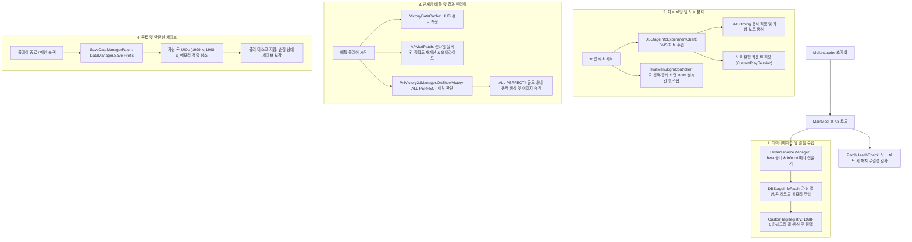

# Muse Dash Custom Chart Mod - 통합 시스템 설계도 및 기술 명세서 (Mod System Blueprint)

이 문서는 `muse-dash-custom-chart` 모드의 전체 동작 메커니즘, 패치 후킹 지도, 핵심 수학 공식, 그리고 데이터 흐름을 일목요연하게 정리한 마스터 기술 명세서입니다.

---

## 1. 시스템 아키텍처 및 데이터 흐름 (Master Architecture & Data Flow)

모드는 MelonLoader의 초기화부터 시작하여 인게임 데이터베이스 로드, 배틀 플레이, 세이브 파일 저장에 이르는 전 과정을 Harmony 후킹을 통해 안전하게 통제합니다.



---

## 2. 후킹 마스터 지도 (Hooking Master Map)

모드가 타겟팅하는 원작 게임(`Assembly-CSharp.dll`)의 핵심 클래스와 후킹 목적을 명시합니다.

| 후킹 대상 클래스 및 메서드 | 패치 타입 | 구현 파일 | 주요 역할 및 유지보수적 목적 |
| :--- | :---: | :--- | :--- |
| `DataManager.Save` | **Prefix** | [SaveDataManagerPatch.cs](file:///h:/source/repos/muse%20dash%20test/muse%20dash%20test/Patches/Database/Save/SaveDataManagerPatch.cs) | 물리 저장 직전 세이브 오염 방지용 가상 레코드(UID) 정밀 정화 |
| `DBStageInfo.SetRuntimeMusicData` | **Prefix** | [DBStageInfoExperimentChart.cs](file:///h:/source/repos/muse%20dash%20test/muse%20dash%20test/Patches/Database/Stage/DBStageInfoExperimentChart.cs) | 커스텀 차트(BMS)를 읽어 인게임 가상 런타임 노트로 복제 및 변환 주입 |
| `TaskStageTarget.AddScore` | **Prefix** | [APModPatch.cs](file:///h:/source/repos/muse%20dash%20test/muse%20dash%20test/Patches/Battle/UI/APModPatch.cs) | 실시간 점수 누계 수집 및 인게임 HUD 폰트 리소스 캐싱 |
| `TaskStageTarget.GetAccuracy` | **Postfix** | [APModPatch.cs](file:///h:/source/repos/muse%20dash%20test/muse%20dash%20test/Patches/Battle/UI/APModPatch.cs) | 소수점 3자리 반올림 가독 정확도 출력 (`GetTrueAccuracyNew` 기반) |
| `TaskStageTarget.GetTrueAccuracy` | **Postfix** | [APModPatch.cs](file:///h:/source/repos/muse%20dash%20test/muse%20dash%20test/Patches/Battle/UI/APModPatch.cs) | 일반 노트 기반 정확도 계산 공식 오버라이드 |
| `TaskStageTarget.GetTrueAccuracyNew` | **Postfix** | [APModPatch.cs](file:///h:/source/repos/muse%20dash%20test/muse%20dash%20test/Patches/Battle/UI/APModPatch.cs) | 기어, 하트, 음표를 합산한 종합 오브젝트 정확도 공식 오버라이드 |
| `PnlVictory2dManager.OnShowVictory` | **Postfix** | [APModPatch.cs](file:///h:/source/repos/muse%20dash%20test/muse%20dash%20test/Patches/Battle/UI/APModPatch.cs) | ALL PERFECT 달성 시 기존 배너 숨김 및 골드 3D 텍스트 배너 주입 |
| `StageBattleComponent.Dead` | **Postfix** | [ChangeHealthValuePatch.cs](file:///h:/source/repos/muse%20dash%20test/muse%20dash%20test/Patches/UI/Custom/HpMod/ChangeHealthValuePatch.cs) | 인게임 사망 이벤트 및 체력 강제 오버라이드(체력 무한 모드 등) |
| `PnlStage.RefreshDiffUI` | **Prefix/Postfix** | [PnlStagePatch.cs](file:///h:/source/repos/muse%20dash%20test/muse%20dash%20test/Patches/UI/Stage/PnlStagePatch.cs) | 곡 선택 시 데모용 AudioSource의 오디오 클립을 비동기 핫스왑 (`HwaMenuBgmController`) |
| `PnlPreparation.OnEnable` | **Prefix/Postfix** | [PnlPreparationPatch.cs](file:///h:/source/repos/muse%20dash%20test/muse%20dash%20test/Patches/UI/Stage/PnlPreparationPatch.cs) | 준비 화면 진입 시 BGM 오디오 클립을 비동기 핫스왑 (`HwaMenuBgmController`) |

---

## 3. 핵심 수학 및 시간 계산 공식 (Core Formulas)

### ① BMS 틱-시간 변환 공식 (BMS Timing Formula)
BMS 파일에서 추출한 `deltaTick`을 누적하여 실제 인게임 오프셋 시간(`time`)을 계산하는 표준 물리 공식입니다.
$$time = time + \left(deltaTick \times \frac{240}{BPM}\right)$$

* **BPM 변경 처리 (BPM Change Accumulation)**:
  차트 내에서 `#BPMxx` 혹은 `#BPM [값]` 이벤트가 감지될 때마다 해당 시점까지 계산된 시간을 기준점으로 고정하고, 이후 구간은 새로운 BPM 값을 대입해 계산을 갱신합니다.

---

### ② 판정 정확도 계산 공식 (Accuracy Formulas)

커스텀 차트는 원본 수록곡의 고정 오브젝트 개수 분모를 사용하면 오차가 발생하므로, 차트 시작 시 스캔한 실제 노트 카운트를 분모로 설정합니다.

#### 1) 일반 판정 정확도 (`GetTrueAccuracy()`)
일반 노트(단타, 롱노트 머리, 샌드백 등) 판정만을 기준으로 계산합니다.
$$\text{Accuracy (Standard)} = \min\left(1.0, \frac{\text{Perfect} + \text{Great} \times 0.5}{\text{TotalStandard}}\right)$$

#### 2) 종합 판정 정확도 (`GetTrueAccuracyNew()`)
톱니바퀴, 하트, 음표를 포함한 모든 오브젝트 판정을 포함하여 계산합니다.
$$\text{Accuracy (All-Object)} = \min\left(1.0, \frac{\text{Perfect} + \text{Great} \times 0.5 + \text{JumpOver} + \text{EnergyCount} + \text{BluePoint}}{\text{TotalStandard} + \text{TotalGears} + \text{TotalHearts} + \text{TotalBlueNotes}}\right)$$

---

## 4. ALL PERFECT 결과 배너 동적 주입 연출 (Victory Banner Injection)

결과 창 진입 시 `APModPatch`가 가상의 게임 오브젝트를 빌드하는 프로세스입니다.

1. **오브젝트 구조 탐색**:
   * Victory 화면 컴포넌트 내부의 `fullCombo` 트랜스폼 하위 자식들(`ImgF`, `ImgU`, `ImgL` 등)을 전부 비활성화(`SetActive(false)`) 처리합니다.
2. **가상 텍스트 오브젝트 (`CustomAPText`) 이식**:
   * 새로운 `GameObject`를 생성하고 `UnityEngine.UI.Text` 컴포넌트를 추가합니다.
3. **폰트 리소스 캐싱 바인딩**:
   * 인게임 플레이 중 스코어 UI 컴포넌트(`scoreValue`)에서 획득한 서명 폰트인 `LuckiestGuy-Regular_150_115`를 바인딩하여 복원합니다. HUD 폰트가 누락된 경우 `PnlVictory` 내의 컴포넌트나 기본 `Arial.ttf`로 순차 폴백합니다.
4. **비주얼 셰이더 및 컴포넌트 속성 세팅**:
   * **텍스트**: `"ALL PERFECT !"` (폰트 크기: `110`)
   * **색상(Color)**: Vibrant Gold/Yellow 그라데이션 광채 컬러 구현 `RGBA(1.0, 0.85, 0.0, 1.0)`
   * **외곽선(Outline)**: 두꺼운 검은색 아웃라인 컴포넌트 추가 (`effectDistance = Vector2(4, -4)`)
   * **그림자(Shadow)**: 부드러운 3D 입체 투영 그림자 컴포넌트 추가 (`effectDistance = Vector2(6, -6)`)

---

## 5. 세이브 가상 레코드 정밀 정화 메커니즘 (Save Purifier Cleansing)

가상 곡 UIDs를 세이브 파일에서 완벽하게 걸러내어, 모드 제거 시에도 크래시를 방지하는 메모리 클렌징 절차입니다.

```
[DataManager.Save 호출]
      │
      ▼
┌────────────────────────────────────────────────────────┐
│ 1. 제네릭 컬렉션 순회 (Account, Task, IAP 등)          │
│    - Key 검사: CustomContentIds.IsVirtualContent(key)  │
│    - 매칭된 가상 필드 즉각 제거 (Remove)               │
└────────────────────────────────────────────────────────┘
      │
      ▼
┌────────────────────────────────────────────────────────┐
│ 2. Achievement 최고기록 & 최근플레이 리스트 정화       │
│    - fields["highest"] 및 fields["recentPassLevelData"]│
│    - 역방향 루프 수행: (Count - 1) down to 0           │
│    - SavedSongResult 캐스팅 검사 및 UID 대조 후 제거   │
└────────────────────────────────────────────────────────┘
      │
      ▼
┌────────────────────────────────────────────────────────┐
│ 3. 3단계 난이도 클리어 리스트 정화                     │
│    - easy_pass, hard_pass, master_pass 리스트 순회      │
│    - 가상 UIDs 발견 시 리스트에서 RemoveAt             │
└────────────────────────────────────────────────────────┘
      │
      ▼
[순정화된 세이브 데이터를 디스크에 라이팅]
```

---

## 6. 전체 문서 디렉토리 인덱스 (Documentation Index)

모드의 각 기술 파트를 세부적으로 깊게 분석하고자 할 때 필요한 원천 마크다운 파일들의 위치와 참조 맵입니다.

1. **환경 빌드 및 초기 셋업**
   * [MODDING.md](file:///h:/source/repos/muse%20dash%20test/docs/MODDING.md): MelonLoader 환경 셋업, 의존성 라이브러리 목록 및 `build.bat` 사용법.
   * [OFFLINE_CUSTOM_SANDBOX_GUIDE.md](file:///h:/source/repos/muse%20dash%20test/docs/OFFLINE_CUSTOM_SANDBOX_GUIDE.md): 골드버그 에뮬레이터 세팅 및 완전 오프라인 모드 보존 환경 설계 가이드.
2. **곡 데이터베이스 확장 및 앨범 태그**
   * [UID_INJECTION.md](file:///h:/source/repos/muse%20dash%20test/docs/UID_INJECTION.md): 가상 앨범 및 가상 곡 UID 동적 인젝션 프로세스 명세.
   * [CAST_AND_CUSTOM_TAG_GUIDE.md](file:///h:/source/repos/muse%20dash%20test/docs/CAST_AND_CUSTOM_TAG_GUIDE.md): IL2CPP 형변환 가이드 및 커스텀 앨범 태그 UI 추가 방법.
3. **BMS 엔진 및 차트 조작**
   * [BMS_PARSING.md](file:///h:/source/repos/muse%20dash%20test/docs/BMS_PARSING.md): BMS 구문 해석, WAV 파일명 파싱 규칙 및 노트 타입 상세 코드 매핑.
   * [NOTE_EXPERIMENTS.md](file:///h:/source/repos/muse%20dash%20test/docs/NOTE_EXPERIMENTS.md): 가상 노트 스펙 정의 및 동적 런타임 생성 구조.
   * [BOSS_EXPERIMENTS.md](file:///h:/source/repos/muse%20dash%20test/docs/BOSS_EXPERIMENTS.md): 보스 액션(애니메이션, 페이즈 전환) 매핑 제어 흐름.
4. **로깅 및 트러블슈팅**
   * [LOGGING_AND_TROUBLESHOOTING.md](file:///h:/source/repos/muse%20dash%20test/docs/LOGGING_AND_TROUBLESHOOTING.md): 디버깅 로깅 기법, 폰트 캐시 및 프레임워크 크래시 자가 진단 가이드.
5. **코어 코드 구조 명세**
   * [CODE_REFERENCE.md](file:///h:/source/repos/muse%20dash%20test/docs/CODE_REFERENCE.md): 각 소스 파일의 구성 요소, 주요 메서드 및 런타임 수명 주기 매칭 레퍼런스.
6. **차세대 플랫폼 (Muse Dash 2) 포팅 가이드**
   * [MUSE_DASH_2_SPECULATIVE_GUIDE.md](file:///h:/source/repos/muse%20dash%20test/docs/MUSE_DASH_2_SPECULATIVE_GUIDE.md): 2026년 말 신작 포팅을 대비한 패치 시나리오 및 설계 로드맵.
   * [MD2_TAG_RETARGET_MAP.md](file:///h:/source/repos/muse%20dash%20test/docs/MD2_TAG_RETARGET_MAP.md): Muse Dash 2의 신규 클래스 매핑 예상 리타게팅 레이아웃.
