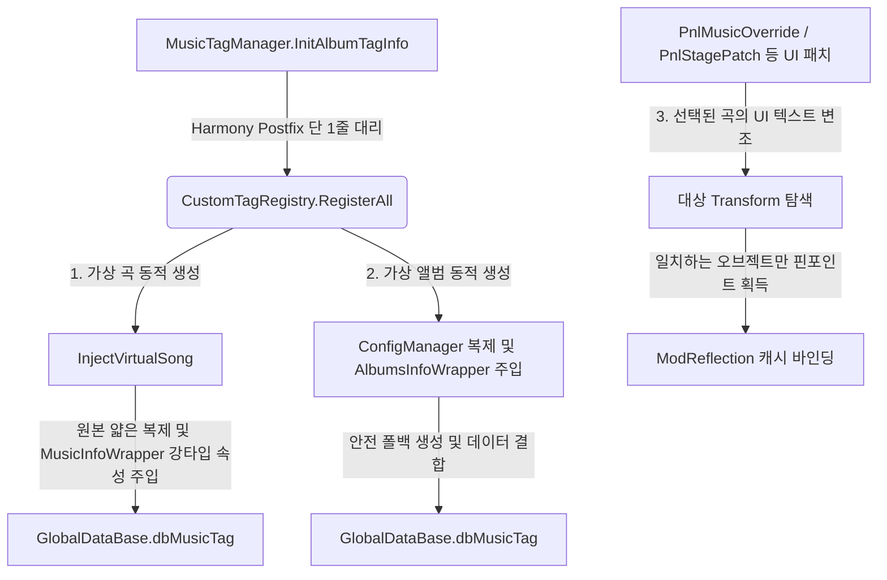

# 🎵 캐스트 추상화 및 커스텀 태그 동적 주입 가이드 (Cast & Custom Tag Guide)

이 문서는 뮤즈대시 모드의 **유니버설 래퍼 패턴(Universal Wrapper Pattern)**과, 이를 기반으로 한 **커스텀 태그(실험 모드) 및 가상 곡/앨범 동적 주입** 시스템의 구조를 설명합니다.

> 비유로 먼저 큰 그림을 잡고 싶다면 → [비유로 이해하는 모드 구조](../getting-started/ANALOGIES.md)

---

## 🏗️ 1. 한눈에 보는 데이터 흐름 (Master Architecture)

패치 레이어와 비즈니스 로직을 분리하여 게임 업데이트 시 코드 수정을 최소화합니다.


```mermaid
graph TD
    A[MusicTagManager.InitAlbumTagInfo] -->|Harmony Postfix 단 1줄 대리| B(CustomTagRegistry.RegisterAll)
    B -->|1. 가상 곡 동적 생성| C[InjectVirtualSong]
    C -->|원본 얇은 복제 및 MusicInfoWrapper 강타입 속성 주입| E[GlobalDataBase.dbMusicTag]
    B -->|2. 가상 앨범 동적 생성| D[ConfigManager 복제 및 AlbumsInfoWrapper 주입]
    D -->|안전 폴백 생성 및 데이터 결합| F[GlobalDataBase.dbMusicTag]
    G[PnlMusicOverride / PnlStagePatch 등 UI 패치] -->|3. 선택된 곡의 UI 텍스트 변조| H[대상 Transform 탐색]
    H -->|일치하는 오브젝트만 핀포인트 획득| I[ModReflection 캐시 바인딩]
```

---

## 💎 2. 래퍼와 얇은 복제 (Wrapper & Clone)

> 이 절의 개념을 비유로 보려면 → [통역사](../getting-started/ANALOGIES.md#21-유니버설-래퍼--통역사-) · [잘 되는 것 복사](../getting-started/ANALOGIES.md#22-얇은-복제--잘-되는-것을-복사한-뒤-이름표만-교체-) · [가격표 떼기](../getting-started/ANALOGIES.md#23-구매-정보-정리--복사된-가격표-떼기-)

### 2.1 유니버설 래퍼 (Universal Wrapper)
IL2CPP Interop 객체에 직접 바인딩하여 다루면 게임 업데이트 때마다 필드 구조가 바뀌어 매번 코드를 고쳐야 합니다. 래퍼 계층(`Il2CppWrapperBase`)을 두면 모더는 C# 강타입 프로퍼티로 접근하고, 래퍼가 리플렉션으로 Interop 객체 필드/프로퍼티 값을 읽고 씁니다.

* **[Il2CppWrapperBase.cs](../../muse%20dash%20test/Patches/Common/Il2CppWrapperBase.cs)**: 모든 래퍼의 베이스 클래스로, 리플렉션 조회를 담당합니다.
* **[ModReflection.cs](../../muse%20dash%20test/Patches/Common/ModReflection.cs)**: 래퍼가 사용하는 필드 검색 모듈입니다. 개발사(PeroPeroGames)가 변수명 앞에 `m_`을 붙이거나 컴파일 과정에서 백킹 필드(`_k__BackingField`)로 이름이 바뀌어도, 대소문자를 무시하고 찾아내어 조회 실패로 인한 오류를 방지합니다.
* **[MusicInfoWrapper.cs](../../muse%20dash%20test/Patches/Common/MusicInfoWrapper.cs) & [AlbumsInfoWrapper.cs](../../muse%20dash%20test/Patches/Common/AlbumsInfoWrapper.cs)**: 각각 곡 정보(`MusicInfo`)와 앨범 정보(`AlbumsInfo`) 전용 래퍼입니다. `music` (에셋 식별자 키) 및 `musicName` (UI 전용 프로퍼티)의 동적 래핑을 지원합니다.
* **[LocalALBUMInfo 로컬라이제이션 인터셉트 (v0.9.2)]**: 게임 엔진의 `MusicInfo.GetLocal(int language)` 및 `DBConfigLocalALBUM.GetLocalAlbumInfoByIndex(int index)` 호출을 훅하여 가상 곡 선택 시 커스텀 `LocalALBUMInfo(name, author)`를 반환합니다. 이로써 언어팩 경로가 원본 곡명을 되돌려 놓는 것을 차단합니다.
  > **주의 — 인덱스 조회는 "누구를 위한 질문인지"를 알려주지 않습니다.** `GetLocalAlbumInfoByIndex`는 곡 UID가 아니라 행 번호만 받고, 가상 곡은 숙주에게서 그 행 번호를 물려받습니다. 그래서 조건 없이 가로채면 **다른 곡의 이름까지 커스텀 곡명으로 바뀝니다**(곡 인덱스 화면에서 실측). 지금은 `SelectedSongLocalizationScope`가 열려 있는 동안 — 선택 곡 한 곡을 그리는 구간 — 에만 답합니다. 자세한 내용은 [CODE_REFERENCE.md](CODE_REFERENCE.md)의 `CustomTagPatch.AlbumPatches.cs` 절을 보세요.
  > **주의 — 수동 덮어쓰기는 아직 제거되지 않았습니다.** `PnlStage.RefreshDiffUI` Postfix의 `ApplyTagTitleForMusicInfo`가 여전히 라벨 텍스트를 직접 씁니다(성공 시 조기 반환). 즉 "네이티브 UI가 스스로 커스텀 곡명을 그린다"는 것은 **아직 검증되지 않은 상태**입니다. 실측 로그(`26-8-6_22-43-5.log`)에서도 가상 곡 선택 중 라벨이 원본 곡명(`单向地铁 Feat.karin`)을 보인 뒤 Postfix가 덮어쓰는 구간이 관측됩니다. 수동 경로를 제거하려면 먼저 그 경로를 끄고 라벨이 유지되는지 재측정해야 합니다.

---

### 2.2 얇은 복제 (Thin Clone)
커스텀 곡 객체를 `new`로 처음부터 만들면 내부 구조의 사소한 불일치로 크래시가 날 수 있습니다. 대신 이미 정상 동작하는 원본 곡 객체를 `MemberwiseClone()`으로 복사한 뒤, 식별자와 제목 등 메타데이터만 덮어쓰는 방식이 안전합니다.

* **`InjectVirtualSong`**: 원본 곡을 얕게 복사해 내부 구조를 보존한 뒤, `MusicInfoWrapper`로 곡 식별자(`1999-1`, `1999-2`, …)와 제목을 덮어씁니다. 앨범 자체의 UID는 `1999-0`이라 곡 번호는 1부터 시작합니다(`CustomContentIds.CreateVirtualSongUid`).
* **폴백 가드 (Fallback)**: 곡은 원본을 찾지 못하면 기본 곡(`0-0`)을 복제 원본으로 씁니다. 앨범 복제가 실패하면 임시 객체(`new AlbumsInfo()`)를 세우는 폴백을 작동시켜 크래시를 방지합니다.

---

### 2.3 상품 식별자 정리 (CleanPurchase)
원본 곡을 복제하면 원본의 DLC 구매 관련 속성까지 함께 복사되어, 유저에게 구매 팝업이 뜰 수 있습니다. 복제 직후 이 속성들을 비워 가상 곡을 무료로 사용할 수 있게 만듭니다.

* **독립성 유지**: `CleanPurchaseProperties`는 복제본에 상속된 `needPurchase`, `free`, `pay_ids`, `dlc` 속성만 정리하므로, 기존 정식 상점이나 원본 구매 기록에는 영향을 주지 않습니다.
* **실제로 걸리는 범위 (게임 6.7.0)**: 이름으로 찾다가 없으면 조용히 건너뜁니다. 6.7.0에서 이 멤버들을 가진 것은 앨범(`AlbumsInfo`)뿐이라 `needPurchase`·`free`·`pay_ids`만 실제로 바뀝니다. 곡(`MusicInfo`/`MusicExInfo`)에는 해당 멤버가 없고, `dlc`는 어디에도 없습니다(2026-09-28 덤프 대조).

---

## 🏷️ 3. 커스텀 태그 및 가상 곡/앨범 동적 주입 (Custom Tag & Registry)

[CustomTagRegistry.cs](../../muse%20dash%20test/Patches/UI/Custom/Tags/CustomTagRegistry.cs) 클래스는 커스텀 카테고리(실험 모드)를 동적으로 이식하는 일련의 시퀀스를 지휘합니다.

1. **태그 탭 생성**:
   태그 버튼이 인스턴스화되는 시점에 모드가 개입하여 아래 사양의 가상 태그를 등록합니다.
   ```csharp
   var info = new AlbumTagInfo
   {
       name = defaultName,          // 영어 이름 "Experiment Mod" (다국어 표는 CreateTagLanguages에 있음)
       tagUid = "tag-muse-dash-test",
       iconName = "IconCustomAlbums" // 커스텀 앨범 전용 기본 아이콘
   };
   ```
   탭 이름은 언어별로 따로 정해 둡니다(한국어 `실험 모드`, 영어 `Experiment Mod`, 일본어 `実験モード`, 중국어 간체/번체 `实验模式`/`實驗模式`).
2. **UI 아이콘 강제 변조 (`AlbumTagToggle_Init_Patch`)**:
   인게임 태그 탭 목록이 그려질 때, 모드는 탭 버튼이 가상 태그 UID(`tag-muse-dash-test`)를 참조하고 있는지 확인합니다. 일치하는 경우, `게임 폴더/hwa tag image/tag_icon.png`를 런타임에 텍스처(`Texture2D`)로 디코딩하여 탭의 아이콘 이미지 필드에 덮어씁니다. 그 파일이 없으면 DLL에 내장된 이미지를 그 자리에 먼저 꺼내 놓습니다(`EmbeddedResource.EnsureExtracted`). 그래서 이 파일을 다른 그림으로 바꿔 두면 그 그림이 쓰입니다.

---

## 🚨 4. 패치 헬스체크와 자동 덤프

> 비유 설명 → [점검 센서](../getting-started/ANALOGIES.md#31-패치-헬스체크--켤-때마다-도는-점검-센서-)

게임 업데이트로 후킹 대상 메서드(`InitAlbumTagInfo`)의 시그니처나 위치가 바뀌면 패치가 실패해 모드가 멈출 수 있습니다. 이를 막기 위해 모드 로드 시점에 후킹 대상의 유효성을 자가 진단합니다.

* **감지 및 자동 덤프**: `InitAlbumTagInfo` 메서드를 찾지 못하면, `MusicTagManager` 클래스의 `Init`으로 시작하는 모든 메서드 정보를 `hwa/tag_manager_dump.txt` 파일로 출력합니다(`PatchHealthCheck.DumpInitMethods`).
* **복구 힌트**: 모더는 이 덤프 파일에서 바뀐 메서드 이름을 찾아 코드를 즉시 업데이트할 수 있습니다.

---

## 🛠️ 5. 확장 및 변형 개발자 가이드 (Developer Extension)

### 5.1 새로운 가상 곡을 추가하고 싶을 때
**코드를 고칠 필요가 없습니다.** 가상 곡은 `hwa` 폴더의 곡 폴더 목록에서 만들어집니다. [CustomTagRegistrySupport.cs](../../muse%20dash%20test/Patches/UI/Custom/Tags/Support/CustomTagRegistrySupport.cs)의 `BuildAndInjectVirtualSongs`가 `HwaResourceManager.GetVirtualUids()`가 돌려주는 UID(`1999-1`, `1999-2`, … — 폴더 정렬 순서대로)마다 곡을 하나씩 주입합니다. 곡 폴더를 추가하고 게임을 다시 켜면 "실험 모드" 태그 탭에 나타납니다. 폴더 구성과 `info.txt` 작성법은 [CUSTOM_CHART_GUIDE.md](../guides/CUSTOM_CHART_GUIDE.md)를 보세요.

제목, 아티스트, 레벨 디자이너, 난이도는 곡 폴더의 `info.txt`에서 읽고, 없으면 `화영왕 <번호>`와 기본 난이도로 채웁니다.

코드를 직접 다루고 싶다면 가상 곡 하나를 만드는 함수는 아래 시그니처입니다. **호출하는 곳은 `BuildAndInjectVirtualSongs` 안의 반복문 하나뿐이니 UID를 하드코딩한 호출을 새로 늘리지는 마세요.** 그렇게 하면 폴더 순서 기반 UID와 겹칩니다.

```csharp
internal static void InjectVirtualSong(
    MusicInfo originalInfo,   // 복제 원본 (info.txt의 원본 곡, 못 찾으면 0-0)
    string uid,               // "1999-N"
    string name, string author, string levelDesigner,
    int diff1, int diff2, int diff3, int diff4, int diff5,
    List<string> musicList);  // 등록된 UID가 여기에 쌓입니다
```

> **커버 · 음원 · 노트 JSON은 지정하지 않습니다.** 가상 곡은 `originalInfo`의 얇은 복제본이므로 `cover` / `music` / `noteJson` 에셋 키를 복제 원본에서 그대로 물려받아 기존 에셋을 재사용합니다. 실제 음원·차트·커버는 곡을 시작하는 시점에 각각 따로 갈아 끼웁니다(BMS는 `DBStageInfo.SetRuntimeMusicData` Postfix, 음원은 BGM 핫스왑, 커버는 UI 패치). 자세한 내용은 [UID_INJECTION.md](../experiments/UID_INJECTION.md)를 참고하세요.

이후 `build.bat`로 빌드했다면 게임 폴더의 `Mods`에 DLL이 실제로 복사됐는지 확인하세요([CHECKLIST.md](../guides/CHECKLIST.md)). 곡 폴더만 추가했다면 빌드는 필요 없습니다.
