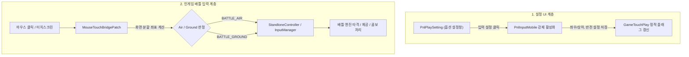

# 📱 모바일 터치 시스템 복원 및 입력 브릿지 가이드 (Mobile Touch & Input Guide)

Muse Dash PC(스팀) 빌드 내부에 잠들어 있던 **모바일 터치 조작 설정 UI([`PnlInputMobile`](file:///h:/source/repos/muse%20dash%20test/Decompiled/Assembly-CSharp/Il2Cpp/PnlInputMobile.cs)) 복원**과 **인게임 배틀 마우스/터치 브릿지([`MouseTouchBridgePatch`](file:///h:/source/repos/muse%20dash%20test/muse%20dash%20test/Patches/Battle/Mechanics/MouseTouchBridgePatch.cs))**에 대한 기술 명세 및 동작 원리 문서입니다.

---

## 1. 시스템 개요 및 배경

Muse Dash는 원래 모바일(iOS / Android)로 개발된 후 PC(Steam)로 이식된 게임입니다. Unity 멀티플랫폼 단일 코드베이스 특성상 PC 스팀 클라이언트 내부에도 모바일 전용 UI 에셋, 번역 텍스트, 터치 판정 로직이 100% 온전히 보존되어 있었습니다.



---

## 2. 모바일 설정 UI 복원 ([`PnlInputMobilePatch.cs`](file:///h:/source/repos/muse%20dash%20test/muse%20dash%20test/Patches/UI/Setting/PnlInputMobilePatch.cs))

### 2.1 패널 구조 및 역할
* **`PnlPlaySetting`:** 인게임 전체 설정 관리 패널. PC 환경에서는 기본적으로 PC용 키 설정(`m_PnlInputSettingStandlone`)을 띄우도록 되어 있음.
* **`PnlInputMobile`:** 모바일 전용 터치 설정 패널.
  * **좌우 분할 모드 (기본):** 화면 왼쪽 = 공중(Air), 화면 오른쪽 = 지상(Ground)
  * **상하 분할 모드:** 화면 위쪽 = 공중(Air), 화면 아래쪽 = 지상(Ground)
  * **되돌리기 (Reverse):** 터치 영역 좌우/상하 반전
  * **수동 / 자동 FEVER:** 피버 발동 모드 설정

### 2.2 패치 구현
```csharp
[HarmonyPatch(typeof(PnlPlaySetting), nameof(PnlPlaySetting.OnAwake))]
public static class PnlPlaySetting_MobileInputPatch
{
    public static void Postfix(PnlPlaySetting __instance)
    {
        if (__instance.m_BtnInputSetting != null)
        {
            __instance.m_BtnInputSetting.onClick.AddListener((UnityAction)(() =>
            {
                // PC용 키설정 패널 숨김 및 모바일 터치 패널 활성화
                if (__instance.m_PnlInputSettingStandlone != null)
                    __instance.m_PnlInputSettingStandlone.SetActive(false);

                if (__instance.m_PnlInputSettingMobile != null)
                    __instance.m_PnlInputSettingMobile.SetActive(true);
            }));
        }
    }
}
```

---

## 3. 배틀 엔진 마우스/터치 브릿지 ([`MouseTouchBridgePatch.cs`](file:///h:/source/repos/muse%20dash%20test/muse%20dash%20test/Patches/Battle/Mechanics/MouseTouchBridgePatch.cs))

### 3.1 PC 입력 파이프라인 분석
PC 빌드에서는 Unity `Input.touches`나 `GameTouchPlay`가 아닌 **[`StandloneController`](file:///h:/source/repos/muse%20dash%20test/Decompiled/Assembly-CSharp/Il2CppAssets.Scripts.GameCore.Controller/StandloneController.cs)**와 **[`InputManager`](file:///h:/source/repos/muse%20dash%20test/Decompiled/Assembly-CSharp/Il2CppAssets.Scripts.PeroTools.Managers/InputManager.cs)**의 3대 메서드를 통해 배틀 입력을 폴링합니다:
1. `GetButtonDown(MDButtonType buttonName)`: 타격 시작 프레임
2. `GetButton(MDButtonType buttonName)`: 홀드(롱노트 및 점프 체공 유지) 프레임
3. `GetButtonUp(MDButtonType buttonName)`: 키 릴리즈 프레임

### 3.2 핵심 트러블슈팅: Air/Ground 동시 발동 버그 해결
* **문제점:** PC 기본 키 매핑에서 마우스 좌클릭이 이미 지상(Ground)으로 할당되어 있어, 화면 왼쪽(공중)을 클릭했을 때 `BATTLE_AIR`(모드 주입)와 `BATTLE_GROUND`(원본 PC 매핑)가 동시에 호출되어 점프하자마자 바닥으로 떨어지는 버그 발생.
* **해결책 (상호 배타적 필터링):**
  * 공중(Air) 영역 클릭 시: `BATTLE_AIR`에 키를 주입하고, `BATTLE_GROUND`에 남아있던 원본 신호는 `result.Clear()`로 완전 차단.
  * 지상(Ground) 영역 클릭 시: `BATTLE_GROUND`에 키를 주입하고, `BATTLE_AIR` 신호는 `result.Clear()`로 완전 차단.
* **키 ID 정규화:**
  * 임의의 큰 인덱스(100 등) 대신 인게임 정규 액션 인덱스(`0`, `1`)를 사용하여 롱노트 및 점프 체공이 끊기지 않고 100% 정상 유지되도록 수정.

### 3.3 화면 분할 좌표 판정 공식
```csharp
private static bool CalculateIsAir(Vector2 screenPos)
{
    bool isLeftRight = GameTouchPlay.isTouchLeftRight;
    bool isReverse = GameTouchPlay.isTouchReverse || GameTouchPlay.isReverse;

    if (isLeftRight)
    {
        // [좌우 분할] 기본: X < Width / 2 이면 공중(Air)
        bool isLeft = screenPos.x < (Screen.width * 0.5f);
        return isReverse ? !isLeft : isLeft;
    }
    else
    {
        // [상하 분할] 기본: Y > Height / 2 이면 공중(Air)
        bool isTop = screenPos.y > (Screen.height * 0.5f);
        return isReverse ? !isTop : isTop;
    }
}
```

---

## 4. 인게임 테스트 및 조작 방법

| 조작 | 동작 | 설명 |
| :--- | :--- | :--- |
| **화면 왼쪽 / 위쪽 좌클릭** | **공중 (Air / Jump)** | 클릭 시 점프 타격, 누르고 있으면 공중 체공 및 롱노트 유지 |
| **화면 오른쪽 / 아래쪽 좌클릭** | **지상 (Ground / Punch)** | 클릭 시 지상 타격, 누르고 있으면 지상 롱노트 유지 |
| **마우스 우클릭** | **두 번째 손가락 (Finger 1)** | 마우스 좌클릭과 번갈아 눌러 고난도 연타 및 동시치기 가능 |
| **터치스크린 직접 터치** | **멀티터치 (Finger ID)** | 서피스, 스팀덱, 액정 태블릿 등에서 모바일과 100% 동일하게 터치 플레이 |

---

## 5. 설정 파일 연동 명세 (Config Files)

### 5.1 `save custom key/config.txt`
메모장 등으로 실시간 수정 가능한 `config.txt`에 `[6] 모바일 터치 조작` 섹션이 추가되었습니다.

```ini
# ============================================================================
#  [6] 모바일 터치 조작 (Mobile Touch & Mouse Bridge)
# ============================================================================
#  모바일터치조작 : true면 인게임 '입력 설정'이 모바일 UI(PnlInputMobile)로 열리고,
#                   마우스 클릭 및 터치스크린 입력을 모바일 터치(공중/지상)로 인식합니다.
#                   (좌우/상하 분할 모드, 되돌리기 반전 설정은 인게임 설정창에서 직접 조절 가능)
#  값 형식        : true / false  (on/off, 켜짐/끔, 1/0 도 됩니다)
# ----------------------------------------------------------------------------
모바일터치조작=true
```

### 5.2 `UserData/MelonPreferences.cfg`
MelonLoader의 통합 기능 토글 설정에도 모바일 터치 기능 On/Off 항목이 등록되어 있습니다.
```toml
[muse-dash-custom-chart-features]
EnableMobileTouch = true
```

---

## 6. 실시간 디버그 로그 예시

```text
📱 [MobileSetting] PnlPlaySetting.OnAwake 감지 - 모바일 입력 설정 패널 연동 시도
📱 [MobileSetting] 입력 설정 버튼 클릭됨! -> PnlInputMobile 강제 표시 시도
📱 [PnlInputMobile] 좌우 분할 모드(LeftRight) 설정 변경됨: True
🖱️ [Touch Down] 공중(AIR) 단독 입력 (X=418, Y=550)
🖱️ [Touch Up] 공중(AIR) 릴리즈
🖱️ [Touch Down] 지상(GROUND) 단독 입력 (X=1510, Y=402)
🖱️ [Touch Up] 지상(GROUND) 릴리즈
```
