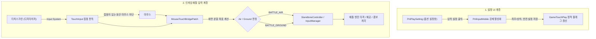

# 📱 모바일 터치 시스템 복원 및 입력 브릿지 가이드 (Mobile Touch & Input Guide)

Muse Dash PC(스팀) 빌드 내부에 잠들어 있던 **모바일 터치 조작 설정 UI([`PnlInputMobile`](file:///h:/source/repos/muse%20dash%20test/Decompiled/Assembly-CSharp/Il2Cpp/PnlInputMobile.cs)) 복원**과 **인게임 배틀 마우스/터치 브릿지([`MouseTouchBridgePatch`](file:///h:/source/repos/muse%20dash%20test/muse%20dash%20test/Patches/Battle/Mechanics/MouseTouchBridgePatch.cs))**에 대한 기술 명세 및 동작 원리 문서입니다.

---

## 1. 시스템 개요 및 배경

Muse Dash는 원래 모바일(iOS / Android)로 개발된 후 PC(Steam)로 이식된 게임입니다. Unity 멀티플랫폼 단일 코드베이스 특성상 PC 스팀 클라이언트 내부에도 모바일 전용 UI 에셋, 번역 텍스트, 터치 판정 로직이 100% 온전히 보존되어 있었습니다.



> [!IMPORTANT]
> 터치스크린은 레거시 `UnityEngine.Input`이 아니라 **새 Input System**으로 읽습니다.
> 이유와 실측 근거는 [3.1 터치 입력 백엔드](#31-터치-입력-백엔드-어느-계층에서-읽는가)를 참고하세요.

---

## 2. 모바일 설정 UI 복원 ([`PnlInputMobilePatch.cs`](file:///h:/source/repos/muse%20dash%20test/muse%20dash%20test/Patches/UI/Setting/PnlInputMobilePatch.cs))

### 2.1 패널 구조 및 역할
* **`PnlPlaySetting`:** 인게임 전체 설정 관리 패널. PC 환경에서는 기본적으로 PC용 키 설정(`m_PnlInputSettingStandlone`)을 띄우도록 되어 있음.
* **`PnlInputMobile`:** 모바일 전용 터치 설정 패널.
  * **좌우 분할 모드 (기본):** 화면 왼쪽 = 공중(Air), 화면 오른쪽 = 지상(Ground)
  * **상하 분할 모드:** 화면 위쪽 = 공중(Air), 화면 아래쪽 = 지상(Ground)
  * **되돌리기 (Reverse):** 터치 영역 좌우/상하 반전
  * **수동 / 자동 FEVER:** 피버 발동 모드 설정

### 2.2 패치 구현
```csharp
[HarmonyPatch(typeof(PnlPlaySetting), nameof(PnlPlaySetting.OnAwake))]
public static class PnlPlaySetting_MobileInputPatch
{
    public static void Postfix(PnlPlaySetting __instance)
    {
        if (__instance.m_BtnInputSetting != null)
        {
            __instance.m_BtnInputSetting.onClick.AddListener((UnityAction)(() =>
            {
                // PC용 키설정 패널 숨김 및 모바일 터치 패널 활성화
                if (__instance.m_PnlInputSettingStandlone != null)
                    __instance.m_PnlInputSettingStandlone.SetActive(false);

                if (__instance.m_PnlInputSettingMobile != null)
                    __instance.m_PnlInputSettingMobile.SetActive(true);
            }));
        }
    }
}
```

---

## 3. 배틀 엔진 마우스/터치 브릿지 ([`MouseTouchBridgePatch.cs`](file:///h:/source/repos/muse%20dash%20test/muse%20dash%20test/Patches/Battle/Mechanics/MouseTouchBridgePatch.cs))

### 3.1 터치 입력 백엔드: 어느 계층에서 읽는가

> 이 절은 ROG Ally에서 화면 터치가 손가락 1개만 인식되던 문제를 추적하며 확정한 내용입니다. **터치 관련 코드를 수정할 때 반드시 먼저 읽으세요.**

**레거시 `UnityEngine.Input`으로는 터치를 읽을 수 없습니다.** 게임이 Unity 2019.4.41f1이고, 이 버전의 레거시 Input은 Windows 스탠드얼론에서 터치 디지타이저를 읽지 못합니다.

가장 위험한 부분은 **레거시 API가 "지원한다"고 거짓으로 답한다**는 점입니다. ROG Ally 실측 결과입니다.

| 계층 | 측정 결과 | 판정 |
| :--- | :--- | :--- |
| **1. Windows** | `SM_DIGITIZER=0xC1` (내장터치 + 멀티터치 + READY), `SM_MAXIMUMTOUCHES=10` | 하드웨어 정상 |
| **2. 레거시 Input** | **`touchSupported=True`** 인데 **`touchCount=0`** | **사망** |
| **3. 새 Input System** | `Touchscreen` 디바이스 `enabled=True`, 접점 슬롯 10개 | **정상** |

`Input.touchSupported`가 `True`라고 해서 터치가 들어온다는 뜻이 아닙니다. 이 값은 OS 능력 조회 결과를 반영할 뿐이고, 실제로는 접점이 하나도 전달되지 않습니다. 게임에 도착하는 것은 Windows가 승격시킨 마우스 이벤트뿐이며, **승격은 손가락 1개만 지원**하므로 공중/지상 동시 입력이 원천적으로 불가능해집니다.

한편 게임의 [`IControlable`](file:///h:/source/repos/muse%20dash%20test/Decompiled/Assembly-CSharp/Il2CppAssets.Scripts.GameCore.Controller/IControlable.cs)에는 `GetTouchs(List<TouchControl>)`가 존재하고 `Unity.InputSystem.dll` 풀 패키지가 탑재되어 있습니다. **게임 자체가 이미 Input System 기반이며, 죽어 있던 것은 레거시 경로 하나뿐이었습니다.**

따라서 접점 판독은 [`TouchInput`](file:///h:/source/repos/muse%20dash%20test/muse%20dash%20test/Core/TouchInput.cs)이 전담합니다.

```csharp
var screen = Touchscreen.current;          // 새 Input System
var touches = screen.touches;              // 접점 슬롯 10개

bool began  = t.press.wasPressedThisFrame;
bool ended  = t.press.wasReleasedThisFrame;
bool held   = t.press.isPressed;
Vector2 pos = t.position.ReadValue();
```

> [!WARNING]
> **접점 식별자로 `touchId`를 쓰면 안 됩니다.** Input System의 `touchId`는 단조 증가하여 플레이가 길어질수록 값이 무한정 커집니다. 게임에 넘기는 식별자는 **슬롯 인덱스(0~9)** 를 사용합니다.

레거시 경로(`Input.touches`)는 다른 환경을 위한 폴백으로만 남아 있으며, Windows에서는 호출되지 않습니다.

#### 마우스 승격 이중 판정 차단

화면에 손가락이 닿아 있는 동안 Windows는 첫 손가락을 **마우스 클릭으로도 승격시켜** 보냅니다. 두 경로를 모두 받으면 한 번의 터치가 두 번 판정됩니다. 이를 막기 위해 접점이 있는 동안과 그 직후 **0.25초** 마우스 입력을 무시합니다.

유예 시간이 필요한 이유가 중요합니다. 승격된 마우스는 터치보다 **한두 프레임 늦게** 도착합니다. 유예 없이 "접점이 있을 때만" 차단하면, 손가락을 떼는 순간 접점은 이미 사라졌는데 승격된 마우스 릴리즈가 뒤늦게 들어와 엉뚱한 레인에 유령 입력을 남깁니다.

손가락이 화면에 없을 때는 실제 마우스가 평소대로 동작합니다.

### 3.2 PC 입력 파이프라인 분석
배틀 입력은 **[`StandloneController`](file:///h:/source/repos/muse%20dash%20test/Decompiled/Assembly-CSharp/Il2CppAssets.Scripts.GameCore.Controller/StandloneController.cs)**와 **[`InputManager`](file:///h:/source/repos/muse%20dash%20test/Decompiled/Assembly-CSharp/Il2CppAssets.Scripts.PeroTools.Managers/InputManager.cs)**의 3대 메서드를 통해 폴링됩니다:
1. `GetButtonDown(MDButtonType buttonName)`: 타격 시작 프레임
2. `GetButton(MDButtonType buttonName)`: 홀드(롱노트 및 점프 체공 유지) 프레임
3. `GetButtonUp(MDButtonType buttonName)`: 키 릴리즈 프레임

### 3.3 핵심 트러블슈팅: Air/Ground 동시 발동 버그 해결
* **문제점:** PC 기본 키 매핑에서 마우스 좌클릭이 이미 지상(Ground)으로 할당되어 있어, 화면 왼쪽(공중)을 클릭했을 때 `BATTLE_AIR`(모드 주입)와 `BATTLE_GROUND`(원본 PC 매핑)가 동시에 호출되어 점프하자마자 바닥으로 떨어지는 버그 발생.
* **해결책 (상호 배타적 필터링):**
  * 공중(Air) 영역 클릭 시: `BATTLE_AIR`에 키를 주입하고, `BATTLE_GROUND`에 남아있던 원본 신호는 `result.Clear()`로 완전 차단.
  * 지상(Ground) 영역 클릭 시: `BATTLE_GROUND`에 키를 주입하고, `BATTLE_AIR` 신호는 `result.Clear()`로 완전 차단.
* **키 ID 정규화:**
  * 임의의 큰 인덱스(100 등) 대신 인게임 정규 액션 인덱스(`0`, `1`)를 사용하여 롱노트 및 점프 체공이 끊기지 않고 100% 정상 유지되도록 수정.

### 3.4 화면 분할 좌표 판정 공식
```csharp
private static bool CalculateIsAir(Vector2 screenPos)
{
    bool isLeftRight = GameTouchPlay.isTouchLeftRight;
    bool isReverse = GameTouchPlay.isTouchReverse || GameTouchPlay.isReverse;

    if (isLeftRight)
    {
        // [좌우 분할] 기본: X < Width / 2 이면 공중(Air)
        bool isLeft = screenPos.x < (Screen.width * 0.5f);
        return isReverse ? !isLeft : isLeft;
    }
    else
    {
        // [상하 분할] 기본: Y > Height / 2 이면 공중(Air)
        bool isTop = screenPos.y > (Screen.height * 0.5f);
        return isReverse ? !isTop : isTop;
    }
}
```

#### 레인 고정 (Lane Latch)

이 판정은 **누르기 시작하는 순간에만** 수행하고, 결과를 접점별로 기억합니다(`_touchSlotIsAir`). 홀드와 릴리즈는 기억해 둔 값을 씁니다.

매 프레임 현재 좌표로 다시 계산하면, 롱노트를 잡은 채 손가락이 분할선을 넘는 순간 판정 레인이 바뀌어 노트가 끊깁니다. 마우스의 `_btn0IsAir` / `_btn1IsAir`와 같은 역할입니다.

---

## 4. 인게임 테스트 및 조작 방법

| 조작 | 동작 | 설명 |
| :--- | :--- | :--- |
| **화면 왼쪽 / 위쪽 좌클릭** | **공중 (Air / Jump)** | 클릭 시 점프 타격, 누르고 있으면 공중 체공 및 롱노트 유지 |
| **화면 오른쪽 / 아래쪽 좌클릭** | **지상 (Ground / Punch)** | 클릭 시 지상 타격, 누르고 있으면 지상 롱노트 유지 |
| **마우스 우클릭** | **두 번째 손가락 (Finger 1)** | 마우스 좌클릭과 번갈아 눌러 고난도 연타 및 동시치기 가능 |
| **터치스크린 직접 터치** | **10접점 멀티터치** | ROG Ally, 스팀덱, 서피스, 액정 태블릿 등에서 모바일과 동일하게 터치 플레이. 두 손가락으로 공중/지상 동시 입력 가능 |

> [!NOTE]
> 터치와 마우스는 **동시에 쓰이지 않습니다.** 화면에 손가락이 닿아 있는 동안에는 마우스가 무시되고(→ [3.1](#마우스-승격-이중-판정-차단)), 손가락을 떼고 0.25초가 지나면 마우스가 다시 동작합니다.

---

## 5. 설정 파일 연동 명세 (Config Files)

### 5.1 `save custom key/config.txt`
메모장 등으로 실시간 수정 가능한 `config.txt`에 `[6] 모바일 터치 조작` 섹션이 추가되었습니다.

```ini
# ============================================================================
#  [6] 모바일 터치 조작 (Mobile Touch & Mouse Bridge)
# ============================================================================
#  모바일터치조작 : true면 인게임 '입력 설정'이 모바일 UI(PnlInputMobile)로 열리고,
#                   마우스 클릭 및 터치스크린 입력을 모바일 터치(공중/지상)로 인식합니다.
#                   (좌우/상하 분할 모드, 되돌리기 반전 설정은 인게임 설정창에서 직접 조절 가능)
#  값 형식        : true / false  (on/off, 켜짐/끔, 1/0 도 됩니다)
# ----------------------------------------------------------------------------
모바일터치조작=false
```

### 5.2 `UserData/MelonPreferences.cfg`
MelonLoader의 통합 기능 토글 설정에도 모바일 터치 기능 On/Off 항목이 등록되어 있습니다. (기본값: `false`)
```toml
[muse-dash-custom-chart-features]
EnableMobileTouch = false
```

---

## 6. 로그

### 6.1 정상 동작 시

배틀 입력은 로그를 남기지 않습니다. 리듬게임 특성상 초당 수 회씩 쌓여 로그 파일이 급격히 비대해지기 때문에, v0.9.9에서 매 입력 로그를 모두 제거했습니다.

터치가 처음 들어올 때 **세션당 한 줄**만 기록합니다. 사용 중인 백엔드를 되짚기 위한 단서입니다.

```text
[TouchInput] 터치스크린 입력을 InputSystem 백엔드로 처리합니다.
```

설정 UI 쪽은 기존 로그가 유지됩니다.

```text
📱 [MobileSetting] PnlPlaySetting.OnAwake 감지 - 모바일 입력 설정 패널 연동 시도
📱 [MobileSetting] 입력 설정 버튼 클릭됨! -> PnlInputMobile 강제 표시 시도
📱 [PnlInputMobile] 좌우 분할 모드(LeftRight) 설정 변경됨: True
```

### 6.2 이상 징후

아래 로그는 정상 동작 중에는 나오지 않습니다. 찍혔다면 그 자체가 문제 신호입니다.

| 로그 | 의미 | 대응 |
| :--- | :--- | :--- |
| `백엔드로 처리합니다` 에 **`Legacy`** 표기 | Input System을 못 찾아 레거시로 폴백 | Windows에서는 터치가 1접점으로 제한됨 |
| `[TouchInput] Input System 판독 실패` | `Touchscreen` 접근 중 예외 | 게임 업데이트로 Input System 구성이 바뀌었는지 확인 |
| `[MouseTouchBridge] Inject... 에러` | 입력 주입 중 예외 | 스택 트레이스로 원인 추적 |

### 6.3 터치가 안 될 때 확인 순서

계층을 하나씩 좁혀야 합니다. 증상만 보고 원인을 단정하면 엉뚱한 곳을 고치게 됩니다.

1. **모바일 터치 모드가 켜져 있는가** — 꺼져 있으면 브릿지 자체가 동작하지 않습니다 (`config.txt`의 `모바일터치조작`)
2. **백엔드 로그가 `InputSystem`인가** — `Legacy`거나 로그 자체가 없으면 접점이 아예 안 들어오는 것입니다
3. **Windows가 디지타이저를 보는가** — `GetSystemMetrics(SM_DIGITIZER)`가 `0x80`(READY) 비트를 포함하는지 확인. 여기서 걸리면 Unity가 아니라 드라이버 문제입니다

> [!TIP]
> 3계층을 한 번에 찍는 진단 프로브를 원인 규명 당시 사용했습니다. 필요하면 [v0.9.7 태그](https://github.com/magjangin/muse-dash-test/releases/tag/v0.9.7)의 `Core/TouchBackendProbe.cs`를 참고하세요. 원인이 확정되어 v0.9.9에서 제거했습니다.
